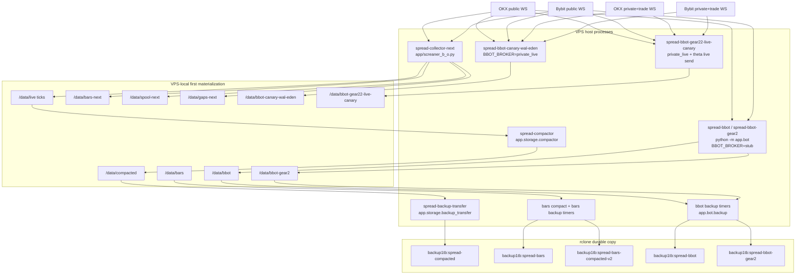
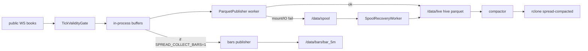
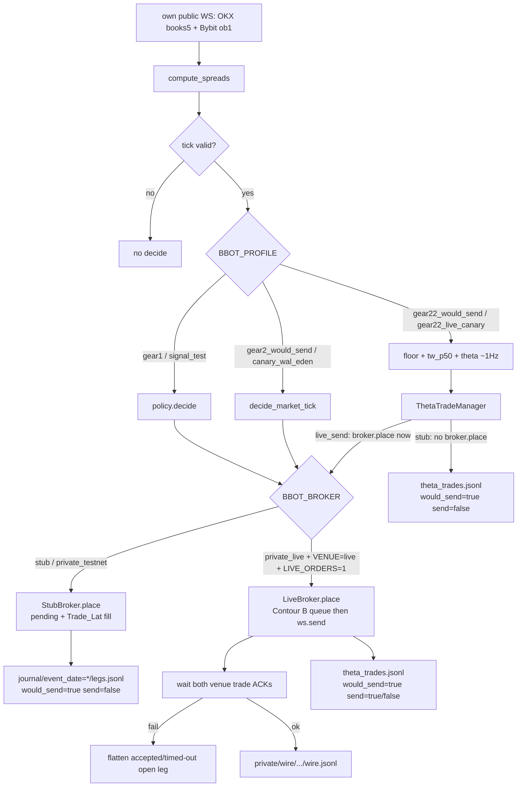

# Architecture snapshot

Agent-native map of live contours, journals, and frozen boundaries.
Read this before non-trivial work. Do not treat chat memory as source of truth.

---

## 1. One-liner

VPS-local public spread collector (D) writes lean parquet + optional bars; a separate asyncio bot (`python -m app.bot`) decides on its own public books and either journals dual-leg `would_send` (stub) or, when gated, sends live dual-leg orders (B-private Contour B). Historical model is offline simulation only.

---

## 2. Stack & Dependencies

| Layer | As coded |
|---|---|
| Language / runtime | Python 3 via `/root/venv/bin/python` in systemd units; local `python3` for tests/validation |
| Async / WS | `asyncio`, `websockets`; collector also imports `ccxt` / `ccxtpro` (`requirements.txt`) |
| Persistence | parquet via `pandas` + `pyarrow` (`app/storage/writer.py`); bot journals are JSONL |
| Backup | rclone SFTP (`BACKUP_RCLONE_*` / `BBOT_RCLONE_*`); lock files under `/run/` |
| Observability | file logs under `/var/log/spread/`; optional Sentry when `SENTRY_DSN` is set (`app/bot/sentry_setup.py`) |
| Universe | Live HOT_ADD writer reads `/root/spread_staging/bybit_okx_universe_hotadd.csv` (`spread-collector-next.service`). `app/utils/universe_csv.py` screens `take=yes`. |
| Crypto filter | `research/is_crypto.py` (`is_hot_add_crypto` for discovery; also bot coin parse) |

`requirements.txt` lists stdlib names plus `ccxt`, `ccxtpro`, `sentry-sdk`. Storage/schema tests also require pandas/pyarrow (not listed there).

HOT_ADD is in this tree: `app/discovery/`, `docs/hot-add-new-coins.md`, and `SPREAD_HOT_ADD=1` on `spread-collector-next.service`. The live writer unit and `spread-discovery.timer` are the VPS copies under `deploy/systemd/`.

---

## 3. Module Map

### Tracks (lines of work, not git branches)

| Track | Owner-ish code | What it is |
|---|---|---|
| 1 Collection / storage | `app/screaner_b_o.py`, `app/storage/*`, `app/schema/*`, `deploy/systemd/spread-collector*`, compactors, D backups | Public L1 ingest → parquet → compact → rclone. **Current reliability priority.** |
| 2 Model | `model.ipynb`, `model_gear2.ipynb`, `docs/strategy-gears.md`, `research/gear22_backtest/` | Historical simulation only. No live orders. |
| 3 Glue | `docs/b-v0-block-diagram.md`, `app/bot/**`, `app/policy/**`, `app/bot/private/**` | Live stub + B-private send. Isolated from D trees. |

Portable policy (pure function, no I/O): `app/policy/trade_manager.py`, `app/policy/gear2_market_manager.py`, `app/policy/features.py`. Model notebook still owns its own VARIATION/HYPER copy.

### Processes found in `deploy/systemd/` (templates in git)

Long-running (`Type=simple`):

| Unit | Entry | Contour |
|---|---|---|
| `spread-collector-next.service` | `app/screaner_b_o.py` | Live D writer (HOT_ADD). WorkingDirectory `/root/spread_staging`. Parquet `/data/live`; spool `/data/spool-next`, gaps `/data/gaps-next`, bars `/data/bars-next`. |
| `spread-collector.service` | `app/screaner_b_o.py` | Previous D unit template. Leave disabled. Do not enable it over the next writer. |
| `spread-bbot.service` | `python -m app.bot` | Historical stub (`BBOT_MODE=probe`, `/data/bbot`). Comments: not enabled merely by existing in git. |
| `spread-bbot-gear2.service` | `python -m app.bot` | Gear-2 `would_send` stub (`BBOT_BROKER` unset → stub). `/data/bbot-gear2`. |
| `spread-bbot-canary-wal-eden.service` | `python -m app.bot` | Live-send canary Contour B (`BBOT_BROKER=private_live`). `/data/bbot-canary-wal-eden`. Secrets via `EnvironmentFile=-/etc/spread/bbot-canary-wal-eden.env`. |
| `spread-bbot-gear22-live-canary.service` | `python -m app.bot` | Gear 2.2 live canary (`BBOT_PROFILE=gear22_live_canary`, `BBOT_THETA_LIVE_SEND=1`). `/data/bbot-gear22-live-canary`. Secrets via `EnvironmentFile=-/etc/spread/bbot-gear22-live-canary.env`. |

Oneshot + timer (D storage):

| Unit | Entry | Role |
|---|---|---|
| `spread-discovery.service` + `.timer` | `python3 -m app.discovery` | HOT_ADD listing sidecar for the next writer. Timer cadence 30 min. Does not start the collector. |
| `spread-compactor.service` + `.timer` | `python -m app.storage.compactor` | Tick hive `/data/live` → `/data/compacted`. Cadence in timer: 2 min. |
| `spread-backup-transfer.service` + `.timer` | `python -m app.storage.backup_transfer` | Compacted ticks → rclone path `spread-compacted`. |
| `spread-bars-compactor.service` + `.timer` | `python -m app.storage.bars_compactor` | `/data/bars/bar_5m` → `/data/bars_compacted_v2/bar_5m`. |
| `spread-bars-backup-transfer.service` + `.timer` | `python -m app.storage.backup_transfer --layout hive` | Hive bars → `spread-bars`. |
| `spread-bars-compacted-backup-transfer.service` + `.timer` | same module | Compacted bars → `spread-bars-compacted-v2`. |

Oneshot + timer (B, isolated prefixes):

| Unit | Entry | Role |
|---|---|---|
| `spread-bbot-backup-transfer.service` + `.timer` | `python -m app.bot.backup` | `{BBOT_DATA_ROOT}/journal` → rclone `spread-bbot`. |
| `spread-bbot-gear2-backup-transfer.service` + `.timer` | `python -m app.bot.backup` | same module, prefix `spread-bbot-gear2`. |

No backup units in this tree for `/data/bbot-canary-wal-eden` or `/data/bbot-gear22-live-canary`.

### Documented on VPS, **not** in `deploy/systemd/` this rev

| Name | Evidence | Status |
|---|---|---|
| `spread-bbot-theta-k1-canary` | `docs/gear22-live-canary.md`, `docs/b-bot-isolation.md`, comment in `theta_trade_manager.py` | **TODO verify** VPS unit file / enablement. Data root claimed: `/data/bbot-theta-k1-canary`. |

### Not systemd (do not confuse with live contours)

| Entry | Role |
|---|---|
| `python -m app.bot.private` | Read-only / explicit-flag CLI harness. Default path asserts **no** order transport and **no** WS (`app/bot/private/__main__.py`). |
| `app/screaner_local_lean.py` | Local lean experiment. Not production. Own `SPREAD_LEAN_*` env names. |
| `model.ipynb` / `research/gear22_backtest/replay.py` | Offline simulation. |
| `deploy/cron/spread-maintenance.cron` | Cron **fallback** vs systemd timers; cadence in cron (compactor every 5 min) **differs** from `spread-compactor.timer` (2 min). **TODO verify** which is installed on VPS. |
| `validation/*.py` | Read-only checks / soak helpers. |

Which of the git unit files are **enabled/active** on the VPS: bot units remain **TODO verify**. Collector, read-only on 2026-09-24 21:32 UTC: `spread-collector-next.service` active, MainPID 4176949, `NRestarts=0`; `spread-collector.service` disabled and inactive; `spread-discovery.timer` enabled and active; `spread-discovery.service` inactive (oneshot). Putting these unit files in git does not start or restart them.

### Frozen bodies (do not edit without explicit unlock)

Collector WS ingest, exchange parse, spread calculation, and trading logic **inside** `app/screaner_b_o.py`. Persistence hooks in that file are the storage seam (`ParquetPublisher`, spool, recovery). Private APIs stay out of the collector.

---

## 4. Runtime Topology

Environments to name on every storage claim: **local development** ≠ **VPS runtime** (`WorkingDirectory=/root/spread_staging`) ≠ **rclone remote copy**. Default writer is VPS-local filesystem (`/data/*`), not a FUSE mount in the production unit. `app/storage/paths.py` still has mount-probe helpers (`DEFAULT_STORAGE_MOUNT=/mnt/storage`). The live unit `spread-collector-next.service` sets `SPREAD_PARQUET_ROOT=/data/live`, `SPREAD_SPOOL_ROOT=/data/spool-next`, `SPREAD_GAPS_ROOT=/data/gaps-next`, and `SPREAD_BARS_ROOT=/data/bars-next`.

No `paper` process mode exists. `VENUE` is `testnet` \| `live` only (`app/bot/private/venue.py`). OKX testnet sets `okx_simulated_trading=True`. Journal schema allows `environment` ∈ {testnet, demo, live} as a **field**, not a systemd contour.

Isolation coded in bot units: `InaccessiblePaths=` D trees (`/data/live`, `/data/bars`, `/data/compacted`, `/data/spool`). Live canary also denies `/data/bbot`, `/data/bbot-gear2`, `/data/bbot-canary-wal-eden`, `/data/bbot-theta-k1-canary`, `/data/bbot-gear22`. Bot path resolver refuses those D prefixes (`app/bot/paths.py`). Private writer also refuses `/data/bbot/journal` (`app/bot/private/paths.py`).

---

## 5. Data Flow

### D collector (storage, not frozen ingest detail)

Production collector unit: `SPREAD_LEAN_SCHEMA=1`, `SPREAD_COLLECT_BARS=0`, `SPREAD_WS_RECONNECT_V2=1`. Bars still have compact/backup units (source tree `/data/bars` may be historical or filled by other means — **TODO verify** VPS).

### B bot: signal → decision → would_send / send → journal

Two decide clocks exist. They must not be mixed in one profile's open path.

Default live send path: Contour B `app/bot/private/ws_trivial_dual_leg.py` (W6 `build_trade_place` frames, then `ws.send`). Full W6 recover→approve→lease→preflight is **off** that path unless `BBOT_PRIVATE_SEND_PATH=w6` **and** `BBOT_PRIVATE_W6=1`. `BBOT_PRIVATE_W6=1` alone does not switch the manager.

`LiveBroker.place` does **not** append stub `legs.jsonl` on success (`on_valid_tick` returns False; fill is venue-observed). Stub `build_leg_record` always sets `would_send=true`, `send=false`; extra fields cannot override those keys.

`python -m app.bot.private` is a separate CLI: W3–W7 experiments journal `bbot.private.journal.v1` under `BBOT_PRIVATE_DATA_ROOT`. It is not the collector and not the default `python -m app.bot` loop.

---

## 6. Critical Paths

Match topology + data-flow diagrams above.

### A. Persist a public tick (D)

1. Collector process `spread-collector-next` / `app/screaner_b_o.py`. `spread-collector.service` stays disabled.
2. Validity gate (`SPREAD_TICK_SKEW_MAX_MS`, `SPREAD_TICK_AGE_MAX_MS`).
3. `ParquetPublisher` enqueue → normalize to lean or v1 body → atomic publish under `SPREAD_PARQUET_ROOT`.
4. On storage failure: durable spool (`SPREAD_SPOOL_ROOT`) + `SpoolRecoveryWorker`.
5. Compactor window → `/data/compacted` → rclone `spread-compacted`.

First materialization: `/data/live`. Durable remote copy of **ticks**: rclone prefix `spread-compacted` (not `/data/live` itself). Logs: `SPREAD_RUNTIME_LOG`, `SPREAD_FAILED_BATCHES_LOG`.

### B. Stub would_send (no private network)

1. `python -m app.bot` with `BBOT_BROKER` unset/stub.
2. Own public books → `TickValidityGate` → `policy.decide` or `decide_market_tick` (or theta manager for gear22 stub).
3. `StubBroker.place` creates pending; fill on next valid tick at `signal_ts + Trade_Lat` (gear22 stub: `BBOT_FILL_DELAY_MS`, default 70 ms in manager).
4. Terminal rows: `{BBOT_DATA_ROOT}/journal/event_date=YYYY-MM-DD/legs.jsonl` (`bbot.journal.v0`) and/or `{BBOT_DATA_ROOT}/theta_trades/.../trades.jsonl`.
5. `would_send=true`, `send=false`. `private_testnet` reuses StubBroker and **refuses** `VENUE=live` and `LIVE_ORDERS=1`.

### C. Live send (fail-closed)

Startup (`assert_theta_live_send_gates` and/or `make_live_broker`):

- `BBOT_BROKER=private_live` (alias `live`)
- `VENUE=live`
- `LIVE_ORDERS=1`
- `send_allowed` = those two venue flags together

Missing `EnvironmentFile` → process fail-closed (unit comments). Warm private+trade WS starts before the signal loop when those flags are on (`BotRuntime.start_private_warm_if_live_send`).

Send: strategy filters in `LiveBroker.place` → Contour B dual `ws.send` → wait both trade ACKs (timeout `BBOT_PRIVATE_ACK_TIMEOUT_SEC`, default 2s) → flatten on one-leg reject/timeout. Chronometry after dual ACK when `BBOT_CHRONOMETRY` is on.

Journals for live: theta_trades `send` flag; private `events.jsonl` (`bbot.private.journal.v1`) when private writer is used; append-only `wire.jsonl` (`bbot.private.wire.v1`). Stub `legs.jsonl` `send` stays false by construction.

### D. Offline model (not a VPS process)

`model.ipynb` / `research/gear22_backtest/`: read parquet; `policy.decide`; dummy 1 Hz replay; fill = `spread_last`, not `Trade_Lat`. Gear 2.2 observation is **closed**. Gear 2.5 blocked until unlock. Not live-ready.

---

## 7. Config & Environment

**Names only. Never put values, keys, or DSNs in docs or logs.**

### Collector / D storage (`SPREAD_*`, `BACKUP_*`)

| Name | Where |
|---|---|
| `SPREAD_PARQUET_ROOT` | ticks hive; unit: `/data/live` |
| `SPREAD_BARS_ROOT` | bars root; unit: `/data/bars` |
| `SPREAD_GAPS_ROOT` | WS gap JSONL; default `/data/gaps` |
| `SPREAD_SPOOL_ROOT` | durable spool; unit: `/data/spool` |
| `SPREAD_SPOOL_MAX_BYTES`, `SPREAD_SPOOL_MAX_FILES`, `SPREAD_SPOOL_TTL_HOURS`, `SPREAD_SPOOL_RECOVERY_INTERVAL_SEC` | spool quotas / recovery |
| `SPREAD_RUNTIME_LOG`, `SPREAD_FAILED_BATCHES_LOG` | collector logs |
| `SPREAD_LEAN_SCHEMA` | `1` → lean tick body |
| `SPREAD_COLLECT_BARS`, `SPREAD_COLLECT_BYBIT_BARS` | bar channels; prod unit bars=0 |
| `SPREAD_WS_RECONNECT_V2`, `SPREAD_WS_CONNECT_PER_SEC`, `SPREAD_SUBSCRIBE_BATCH_SIZE`, `SPREAD_SUBSCRIBE_BATCH_PAUSE_SEC` | reconnect / subscribe |
| `SPREAD_TICK_SKEW_MAX_MS`, `SPREAD_TICK_AGE_MAX_MS` | fail-closed tick |
| `SPREAD_UNIVERSE`, `SPREAD_ROW_START`, `SPREAD_ROW_END` | pair slice over `take=yes` |
| `SPREAD_PERSIST_EVERY`, `SPREAD_BAR_PERSIST_EVERY` | buffer flush counts |
| `BACKUP_COMPACTED_DIR`, `BACKUP_LAYOUT`, `BACKUP_RCLONE_BINARY`, `BACKUP_RCLONE_REMOTE`, `BACKUP_RCLONE_PATH`, `BACKUP_SFTP_KEY_PATH`, `BACKUP_RCLONE_SFTP_CONCURRENCY`, `BACKUP_RCLONE_SFTP_CHUNK_SIZE`, `BACKUP_TRANSFER_LOCK_PATH`, `BACKUP_SENT_RETENTION_HOURS`, `BACKUP_HIVE_BATCH_SIZE`, `BACKUP_MAX_FILES`, `BACKUP_SKIP_SHA_VERIFY_BELOW_BYTES`, `BACKUP_SHARED_LOCK_PATH` | D rclone transfer |

Local lean only: `SPREAD_LEAN_PARQUET_ROOT`, `SPREAD_LEAN_BARS_ROOT`, `SPREAD_LEAN_RUNTIME_LOG`, `SPREAD_LEAN_UNIVERSE`, `SPREAD_LEAN_ROW_START`, `SPREAD_LEAN_ROW_END`, `SPREAD_LEAN_PERSIST_EVERY`.

### Bot (`BBOT_*`)

| Name | Role |
|---|---|
| `BBOT_MODE` | `probe` \| `policy` |
| `BBOT_PROFILE` | `gear1`, `signal_test`, `gear2_would_send` (`gear2`), `canary_wal_eden` (`canary`), `gear22_would_send` (`gear22`), `gear22_live_canary` (`gear22_live`) |
| `BBOT_BROKER` | `stub` (default) \| `private_testnet` \| `private_live` (`live`) |
| `BBOT_COINS`, `BBOT_NOTIONAL_USDT`, `BBOT_TRADE_LAT_MS` | universe / size / stub Trade_Lat |
| `BBOT_DATA_ROOT`, `BBOT_LOG_PATH` | bot data + log (never `runtime.log`) |
| `BBOT_THETA_TRADE`, `BBOT_THETA_LIVE_SEND` | gear22 trade / live arm |
| `BBOT_THETA_OPEN`, `BBOT_P50_OPEN`, `BBOT_MIN_PROFIT_PP`, `BBOT_MIN_THETA_CLOSE`, `BBOT_FEE_RT_PP`, `BBOT_FILL_DELAY_MS`, `BBOT_SLOT_K`, `BBOT_THETA_THR` | frozen-knob overlays |
| `BBOT_FLOOR_WATCH`, `BBOT_TW_P50_WATCH`, `BBOT_THETA_WATCH`, `BBOT_FLOOR_WARM`, `BBOT_FLOOR_BAR_SAMPLE_CAP` | observers |
| `BBOT_CHRONOMETRY`, `BBOT_L1_RING` | live canary instrumentation |
| `BBOT_PRIVATE_DATA_ROOT`, `BBOT_PRIVATE_LOG_PATH`, `BBOT_PRIVATE_ENV_FILE` | private journal / secret **path** |
| `BBOT_PRIVATE_SEND_PATH`, `BBOT_PRIVATE_W6`, `W6_DUAL_LEG`, `BBOT_PRIVATE_W4`/`W4_POST_ONLY`, `BBOT_PRIVATE_W5`/`W5_MARKET`, `BBOT_PRIVATE_W7`/`W7_PARALLEL_DUAL_LEG` | send-path / experiment flags |
| `BBOT_PRIVATE_ACK_TIMEOUT_SEC`, `BBOT_OKX_INST_ID_CODES` | live ACK / OKX inst codes |
| `BBOT_RCLONE_BIN`, `BBOT_RCLONE_REMOTE`, `BBOT_RCLONE_PATH`, `BBOT_BACKUP_LOCK` | bot backup only |
| `BBOT_GIT_BRANCH` | Sentry tag helper |

### Venue / send gates (not credentials)

| Name | Role |
|---|---|
| `VENUE` | `testnet` (default) \| `live` |
| `LIVE_ORDERS` | default off; `1` required for live send |

Do **not** put `VENUE` / `LIVE_ORDERS` in the credential file (`config/bbot-private-live.env.template`).

### Secret **file paths** and **key names** (no values)

Files outside git, mode 600 on VPS (as documented in units/template):

- `/etc/spread/bbot-private-testnet.env` (alias `/etc/spread/bbot-private.env`)
- `/etc/spread/bbot-private-live.env`
- `/etc/spread/bbot-canary-wal-eden.env`
- `/etc/spread/bbot-gear22-live-canary.env`

Key **names** in `app/bot/private/secrets.py`: `BYBIT_TESTNET_API_KEY`, `BYBIT_TESTNET_API_SECRET`, `OKX_DEMO_API_KEY`, `OKX_DEMO_API_SECRET`, `OKX_DEMO_PASSPHRASE`; live: `BYBIT_LIVE_API_KEY`, `BYBIT_LIVE_API_SECRET`, `OKX_LIVE_API_KEY`, `OKX_LIVE_API_SECRET`, `OKX_LIVE_PASSPHRASE`. Sentry: `SENTRY_DSN`, `SENTRY_ENVIRONMENT`, `SENTRY_BRANCH`. Testnet process must not load live-named keys; live profile must not load testnet/demo-named keys.

---

## 8. Storage & Journals

### D trees (collector only)

| Path | What |
|---|---|
| `/data/live/base_coin=*/event_date=*/*.parquet` | Tick hive. First write, not the durable remote copy. |
| `/data/live/.tmp`, `/data/live/archived` | Publisher tmp; compactor archive |
| `/data/spool` | Durable local spool on publish failure |
| `/data/bars/bar_5m/...` | 5m bar source hive |
| `/data/bars_compacted_v2/bar_5m/...` | Compacted bars v2 |
| `/data/compacted` | Compacted ticks |
| `/data/gaps/event_date=*/gaps.jsonl` | WS reconnect gaps (`app/schema/ws_gap.py`) |
| `/var/log/spread/runtime.log`, `failed_batches.log`, `compactor.log`, `backup-transfer.log`, `bars-*.log` | D logs |

Schema: lean ticks `LEAN_TICK_BODY_COLS`; v1 `SPREAD_EVENT_BODY_COLS`; bars `LEAN_BAR_5M_BODY_COLS`. Contract: `docs/storage-contract.md`. Spreads are **derived at read** from complete L1 in lean mode.

### B stub / canary data roots

Created by `resolve_data_root()`: `journal/`, `floor/`, `tw_p50/`, `theta/`, `theta_trades/`, `state/`, `.tmp/`.

| Root (as in units) | Journal files |
|---|---|
| `/data/bbot` | `journal/event_date=*/legs.jsonl` (`bbot.journal.v0`) |
| `/data/bbot-gear2` | same layout, isolated |
| `/data/bbot-canary-wal-eden` | same + live wire/private if configured |
| `/data/bbot-gear22-live-canary` | theta_trades + floor/tw/theta metrics; `BBOT_PRIVATE_DATA_ROOT=.../private` |
| `/data/bbot-theta-k1-canary` | claimed in docs for would_send canary; **unit not in this tree** — **TODO verify** |

Also: `{root}/floor/event_date=*/metrics.jsonl` (`bbot.floor.v1`); `tw_p50/.../metrics.jsonl`; `theta/.../metrics.jsonl`; `theta_trades/.../trades.jsonl`; `{root}/state/pending.json`, `state/floor_warm.pkl`.

### B-private

Default `BBOT_PRIVATE_DATA_ROOT=/data/bbot/private` (or `<repo>/output/bbot/private` if default not writable).

| Path | Schema |
|---|---|
| `{private}/journal/event_date=*/events.jsonl` | `bbot.private.journal.v1` |
| `{private}/wire/event_date=*/wire.jsonl` | `bbot.private.wire.v1` (redacted) |
| `{private}/probes/.../auth_probe.jsonl` | legacy probes |
| `{private}/reports/trades/<intent_id>/` | trade reports |
| `{private}/state/` | in-process / restart state |

WAL/EDEN unit does **not** set `BBOT_PRIVATE_DATA_ROOT` and sets `InaccessiblePaths=/data/bbot`. Default private root is under `/data/bbot/private`. **TODO verify** where that canary actually writes private/wire journals at runtime.

Local fallback if `/data/bbot` not writable: `<repo>/output/bbot`.

---

## 9. Constraints & Invariants

- **Contour boundary:** bot must never write `/data/live`, `/data/bars`, `/data/compacted`, `/data/spool`. Collector must never load private APIs or keys.
- **Do not stop or restart** `spread-collector-next` to work on B. Do not enable `spread-collector.service`. Do not `BindsTo=` the collector from bot units.
- **Secrets:** never in git, architecture.md, AGENTS.md, runtime collector logs, or journal payloads (wire redacts sign/key fields).
- **Live send:** `VENUE=live` **and** `LIVE_ORDERS=1` **and** `BBOT_BROKER=private_live`. Env-hack without `make_broker()` / gate patch is forbidden by agent policy. GREEN would_send ≠ live permission.
- **Stub journal v0:** `would_send=true`, `send=false`, dual legs same `intent_id` + notional, `k_live=1`, terminal `filled`\|`aborted` only in `legs.jsonl`.
- **K_live = 1** on live/stub managers coded here.
- **Lean vs v1:** do not mix tick schemas in one day partition without a dual reader.
- **Frozen collector bodies:** ingest, parse, spread calc — no drive-by edits.
- **Model ≠ live:** closing a gear in `docs/strategy-gears.md` is not bot readiness.
- **Risk cap** (policy/docs): ≈ 100 USD per exchange for live; canary units set notional 10 or 20 USDT/leg in the unit file — still a policy cap, not a profitability claim.
- **Host Ops agent:** not created for stub/testnet; deferred to first live (non-testnet) order in B-private chat.

---

## 10. Known Tech Debt & Hotspots

| Hotspot | Why it burns |
|---|---|
| `app/screaner_b_o.py` | Production ingest **and** persistence hooks in one file. Ingest frozen; storage changes must stay at publisher/spool/recovery. |
| Collector unit `SPREAD_COLLECT_BARS=0` vs bars compact/backup units | Bars pipeline exists; production collector flag is off. **TODO verify** what still writes `/data/bars`. |
| Compactor timer 2 min vs cron snippet 5 min vs service `--interval 300` | Three cadences in tree. **TODO verify** installed one. |
| `LiveBroker` vs `legs.jsonl` | Live success does not set `send=true` in stub journal (cannot override). Operators must read theta_trades + private/wire. |
| WAL/EDEN `BBOT_PRIVATE_DATA_ROOT` unset vs `InaccessiblePaths=/data/bbot` | Private default path may be unreachable. **TODO verify**. |
| `spread-bbot-theta-k1-canary` | Documented VPS would_send canary; **no unit file in this rev**. |
| Live canary / WAL-EDEN backup | No matching `app.bot.backup` units in `deploy/systemd`. |
| `make_broker` return type annotation | Annotated `-> StubBroker` but can return `LiveBroker`. |
| Policy duplicated | `app/policy/trade_manager.py` vs notebook VARIATION/HYPER. Drift is a contract bug. |
| `deploy/README.md` | Lists collector/compactor/backup; incomplete vs current bot/canary units. |
| Storage architecture | `AGENTS.md`: not finally decided. Hybrid spool+local primary is the coded path, not a closed design review. |
| `python -m app.bot.private` vs `python -m app.bot` | Two entrypoints; default private CLI cannot send. Easy to confuse with live canary. |

---

## 11. Glossary

| Term | Meaning here |
|---|---|
| D | Public collector contour (`screaner_b_o.py` + `/data/live` trees) |
| B / B-bot | Live asyncio stub bot, `app/bot/**` except `private/` |
| B-private | `app/bot/private/**`; testnet then live send |
| Contour B | Default live send: queue → `ws.send` (`ws_trivial_dual_leg`) |
| W6 | Sequential dual-leg with recover/approve/lease; opt-in on manager |
| would_send | Journaled intent that **would** have been sent; stub `send=false` |
| send | Actual venue `ws.send` / order transport. Requires live gates. |
| paper | **Not a coded process mode.** Do not invent one. |
| canary | Isolated profile + data root (WAL/EDEN or gear22 live / theta-k1 docs) |
| testnet / demo | `VENUE=testnet`; OKX simulated trading flag; demo **key names** |
| live | `VENUE=live`. Orders only with `LIVE_ORDERS=1`. |
| lean | Tick parquet without precomputed spread columns |
| hive | `base_coin=*/event_date=*` directory layout |
| Gear 1.0 / 1.5 / 2 / 2.2 | Model-track maturity; 2.2 = observation contour, not live-ready |
| K_live | Max concurrent open slot (coded 1) |
| Trade_Lat | Stub fill delay from signal tick (gear1 HYPER 100 ms); live fills are venue ACKs |
| take=yes | Universe CSV live pair screen |
| spool | Local durable parquet staging when primary publish fails |

---

## 12. Snapshot meta

| Field | Value |
|---|---|
| Date (UTC) | 2026-09-19 |
| Branch | `cursor/architecture-snapshot-c20d` |
| Git rev | `bfc5a29` (short; `origin/main` at snapshot) |
| Coverage | L2: processes + main flows |
| Source of truth | Files in this tree at that rev. VPS enablement and live PIDs not observed in this change. |
| Inspected | `AGENTS.md`, `app/screaner_b_o.py` (storage hooks only), `app/storage/*`, `app/schema/*`, `app/bot/**` including `private/`, `app/policy/*`, `deploy/systemd/*`, `validation/`, `docs/b-v0-block-diagram.md`, `docs/storage-contract.md`, `docs/strategy-gears.md`, `config/bbot-private-live.env.template`, `requirements.txt` |
| HOT_ADD | In tree since PR #53 (`app/discovery/`, `docs/hot-add-new-coins.md`). Live writer unit `spread-collector-next.service` and `spread-discovery.timer` added from the VPS copy. |
| Secrets | None included. |

### Want to change X → open files Y

| Want to change | Open |
|---|---|
| Collector persist / spool / shutdown | `app/storage/writer.py`, `spool.py`, `recovery.py`, `paths.py`; persistence calls in `app/screaner_b_o.py` only — not ingest/parse/spread bodies |
| Tick/bar schema | `app/schema/*`, `docs/storage-contract.md`, then writer, then `validation/check_published_parquet.py` |
| Compaction / D backup | `app/storage/compactor.py`, `bars_compactor.py`, `backup_transfer.py`, matching `deploy/systemd/spread-*.service` |
| Stub decide / would_send | `app/policy/trade_manager.py`, `app/bot/runtime.py`, `stub_broker.py`, `journal.py` |
| Gear 2.2 theta / live canary knobs | `app/bot/theta_trade_manager.py`, `runtime.py`, `deploy/systemd/spread-bbot-gear22-live-canary.service` |
| Live send path | `app/bot/broker.py`, `private/live_broker.py`, `private/ws_trivial_dual_leg.py`, `private/venue.py` — not `stub_broker.py` |
| Private journal / wire | `app/bot/private/journal_v1.py`, `paths.py`, `wire_transcript.py` |
| Secrets loading | `app/bot/private/secrets.py` (names/paths only in git) |
| Historical gears | `docs/strategy-gears.md`, `model.ipynb`, `research/gear22_backtest/` |
| Glue block diagram | `docs/b-v0-block-diagram.md` **and this file** in the same change |
| Isolation / D deny | `app/bot/paths.py`, `app/bot/private/paths.py`, bot systemd `ReadWritePaths` / `InaccessiblePaths` |
| Validation of journals / D | `validation/check_bbot_*.py`, `check_file_lifecycle.py`, `check_mount.py`, `check_published_parquet.py` |

When you change topology (new process, send path, journal layout, contour boundary): update this file in the same change.
