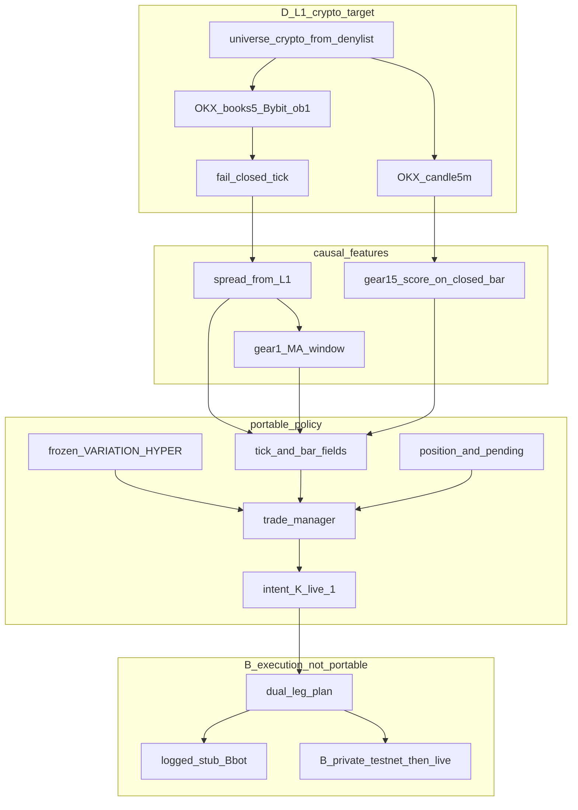

# B-v0 — блок-схема изначального торгового контура

Трек: склейка. Дата фиксации: 2026-08-17.  
Владелец смысла: Orchestrator / GD.

Слои и контракт политики — здесь. Реализация **живого** stub-бота на VPS —
отдельный чат B-bot ([`b-bot-starter-prompt.md`](b-bot-starter-prompt.md)):
async, свои публичные WS, сделки-заглушки, изоляция от D. Приватные каналы —
чат B-private ([`b-private-starter-prompt.md`](b-private-starter-prompt.md),
unlock [`b-private-unlock.md`](b-private-unlock.md)): testnet/demo, затем live.
Это не replay parquet и не изменение `app/screaner_b_o.py`.
Публичная механика — профиль D
[`b-public-l1-gate-config.md`](b-public-l1-gate-config.md). Вселенная v0 —
крипто-подмножество; это **новый** профиль `L1-crypto`, не перенос гейта `N=337`.

---

## 1. Что зафиксировано

| Поле | Значение |
|------|----------|
| Актив | только crypto USDT perps; equity/ETF/metal — нет |
| Фильтр | [`research/is_crypto.py`](../research/is_crypto.py) + [`research/data/non_crypto_base_coins.txt`](../research/data/non_crypto_base_coins.txt) |
| `K_live` | 1: менеджер смотрит все крипто-возможности, входит в одну |
| Спред | при чтении из L1: long `(bybit_bid−okx_ask)/bybit_bid×100`, short `(okx_bid−bybit_ask)/okx_bid×100` |
| Признаки гира 1 | causal MA / `open_frac` по ряду спреда (тики) |
| Признаки гира 1.5 | score / Top‑N только с **закрытого** `bar_5m` |
| Исполнение v0 | заглушка dual-leg в B-bot; private — чат B-private (testnet→live) |
| Процесс | бот отдельно от collector |

Снимок вселенной на 2026-08-17: CSV `345` строк, crypto `249`, non-crypto `96`.
Принятый D-гейт — `ROW_END=337` (не путать с текущим CSV). `N_crypto` всегда
пересчитывать скриптом, не формулой «336 минус акции». Неизвестный тикер по
умолчанию crypto, пока его нет в denylist.

---

## 2. Три «N»

| Имя | Смысл | Статус |
|-----|--------|--------|
| `N_L1_proven` | 337 пар, lean+bars, гейт 16.08 | доказанный потолок нагрузки |
| `N_public_v0` = `N_trade` | crypto-only книги + OKX `candle5m` на обеих биржах | целевой subscribe set; ждёт гейт D `L1-crypto` |
| `N_private` | private WS | неизвестно; в v0 не измерять |

Гипотеза «меньше сокетов → p99 не хуже / лучше» правдоподобна. Цифры 16.08
на 337 парах **нельзя** закладывать в `L1-crypto` без двух независимых окон
60 мин (p99, S/P, dual, reconnect). Пока гейт не закрыт, в расчётах нагрузки
использовать `N_L1_proven` как потолок.

---

## 3. Слои

Три слоя. Переносится между M и B только политика. Исполнение — нет.

### Публичный контур (D)

Та же механика, что у принятого `L1`: lean schema, OKX `books5` + Bybit
`orderbook.1`, OKX `candle5m`, reconnect v2, fail-closed тик (дыра лучше
устаревшего спреда). Меняется только список пар: crypto-only.

Collector не содержит торговой логики. Бот — отдельный процесс.

### Признаки (causal)

- Спред из полного L1 при чтении.
- MA / доли усреднения гира 1.0 — по тиковому ряду спреда.
- Score / Top‑N гира 1.5 — после close бара `5m`, не на каждом тике.
- Не торговать и не считать сигнал по suppress / stale / generation.

Два такта нельзя смешивать: бар-фичи не обновляются внутри незакрытого окна.

### Политика (переносимый менеджер)

Чистая функция. Общий смысл с гиром 1.0; кластер 1.5 — признак, не unsubscribe.

**Конфиг (как в M):** замороженные `VARIATION` и `HYPER` — пороги,
`open_frac` / `close_frac`, `avg_window_sec`, `Trade_Lat`, `fee_rate`,
`position_frac`, `Check_volume`.

**Сообщение события:** L1 snapshot, validity/suppress, latency/freshness,
size, timestamps, закрытый bar (volume/OHLC), уже посчитанные causal
spread / MA / score.

**Состояние бота:** позиция, pending fill, слот `K_live=1`.

**Выход:** `intent` ∈ {`flat`, `open_long`, `open_short`, `close`} и причина
отсева. Не qty биржи, не order id, не ACK.

**Запрет внутри блока:** I/O, время стены «сейчас», будущие бары, ключи,
private, lot rounding, PnL-оптимизация.

M вызывает тот же блок по историческому ряду. B — на каждом валидном тике
крипто-монеты. Расхождение M↔B — баг контракта.

### Исполнение (только B)

`open_long` / `open_short` значит dual-leg: long на одной бирже и short на
другой, один notional. Заглушка логирует план двух ног (`would_send`), не
«сделку по спреду».

В плане (ещё не код): какая нога первая; abort второй; qty vs quote;
lot/tick/min из [`bybit_okx_universe.csv`](../bybit_okx_universe.csv).

Private WS и заявки — **чат B-private**, не collector и не stub-брокер.
Unlock 2026-08-18: testnet/demo сначала; live — после журнала и явной фразы.
На этапе заглушек B-bot сокеты private не открываем. Intent подписки private:
«все крипто»; top-10 vs all — отдельный опыт, не первый harness.

---

## 4. Правила склейки

- Считать спреды при чтении, не требовать колонки `spread_*` в новых тиках.
- Не строить сигнал по подавленному тику.
- Плановый обрыв и неполное окно — честная дыра.
- Бар-score — только после close.
- Не писать торговлю в `app/screaner_b_o.py`.
- Не переносить p99 профиля 337 на `L1-crypto` без окон D.
- Не обещать, что private на всех крипто не деградирует контур.

---

## 5. Что схема v0 не решает

Private top-10 vs all; несколько частичных позиций (гир 2); политика размера
(гир 2.5); сторож и vacation-hardening D; прибыльность; внедрение `L1-crypto`
в collector. Live send — чат B-private после testnet, не этот документ.
Host Ops — только с первой live (не testnet) заявкой.

---

## 6. Следующие чаты (не этот)

1. **B-bot** — открыт: живой async на VPS, stub-сделки, свои пути/unit/backup.
   Не replay. Не мешать collector. Постановка [`b-bot-starter-prompt.md`](b-bot-starter-prompt.md).
2. **B-private** — адаптер закрыт (P9): [`b-private-status.md`](b-private-status.md),
   unlock [`b-private-unlock.md`](b-private-unlock.md). Стык `Broker` со stub — отдельный гейт.
3. **Host Ops** — при постоянном процессе с живыми заявками (не stub / не one-shot).
4. **D `L1-crypto`** — новый latency-гейт на crypto-only universe.

---

## Ссылки

- Статус private: [`b-private-status.md`](b-private-status.md); unlock: [`b-private-unlock.md`](b-private-unlock.md); постановка [`b-private-starter-prompt.md`](b-private-starter-prompt.md)
- Основа D: [`d-track-ready-for-b.md`](d-track-ready-for-b.md), [`b-public-l1-gate-config.md`](b-public-l1-gate-config.md)
- Гиры: [`strategy-gears.md`](strategy-gears.md)
- Поля модели: [`data-format-model.md`](data-format-model.md)
- Дорожная карта: [`program-roadmap.md`](program-roadmap.md)
