# Блок-схема и архитектура Гира 2 (мультимонетный симулятор)

**Трек:** Модель (историческая симуляция).  
**Статус:** гир 2 = закрыт (контур; 2.2 вне scope). v0 в [`model_gear2.ipynb`](../model_gear2.ipynb). **Следующий этап лестницы — гир 2.2** (stats/C/D), не 2.5 и не 3. **Контракт порядка гейтов = код** [`research/gear2_backtest.py`](../research/gear2_backtest.py), не mermaid и не `gear2.svg`.  
**Владельцы:** Model Simulator Agent (математика и логика симулятора), Text Stylist Agent (структура и формулировки), Orchestrator / Review Critic (архитектурный надзор).  
**Связанные документы и схемы:** [`strategy-gears.md`](strategy-gears.md), [`gear-2-close-20260825.md`](gear-2-close-20260825.md), [`gear-2-private-params.md`](gear-2-private-params.md), [`regime-metrics-v0.md`](regime-metrics-v0.md), [`b-v0-block-diagram.md`](b-v0-block-diagram.md), векторная схема [`gear2.svg`](../gear2.svg) (для Гира 1 — [`gear1.svg`](../gear1.svg)).

---

## 1. Назначение и ключевые отличия от Гира 1.0

Гир 2 переносит **зафиксированную логику Гира 1.0** (неизменный вектор порогов `VARIATION` и замороженные гиперпараметры `HYPER`) из пространства одной монеты в **сквозной мультимонетный поток рынка**.

| Характеристика | Гир 1.0 (одна монета) | Гир 2.0 (мультимонета v0) |
| :--- | :--- | :--- |
| **Охват рынка** | Строго 1 выбранная пара (напр. BTC/USDT) | Все доступные крипто-инструменты (`is_crypto` denylist) |
| **Поток данных** | Монохромный временной ряд тиков | Глобальный сквозной ряд, упорядоченный по `(event_local_ts_ms, base_coin)` |
| **Скользящее среднее (Gate B)** | Единое окно по тикам одной монеты | **Поканальный расчёт:** окно усреднения строится строго внутри тиков конкретной монеты `coin` |
| **Управление капиталом** | `pos` в рамках одного инструмента | **Лимит слотов `K=1`:** вход в одну лучшую монету; блокировка параллельных входов |
| **Отсев при занятом слоте** | Отсутствует (монета одна) | **`n_filtered_slot_busy`** после fill; **`n_filtered_pending_skip`** пока ждём fill |
| **Исполнение задержки (`Trade_Lat`)** | Первый тик ряда с $ts \ge signal\_ts + Trade\_Lat$ | Первый будущий тик **той же самой монеты** `_resolve_fill_same_coin` |
| **Выход из позиции** | По тикам той же монеты | Выход возможен **только** по тикам удерживаемой монеты (`held_coin == coin`) |
| **Скринер режима (Гир 1.5)** | Отсутствует | Опциональный гейт-флаг кластера Top-N волатильности по закрытым 5m барам |

---

## 2. Инварианты симулятора Гира 2

1. **Единый временной горизонт:** Все тики всех монет сливаются в один массив и стабильно сортируются (`mergesort`) по `event_local_ts_ms`, а при равенстве времени — по `base_coin`. Заглядывание в будущее строго запрещено.
2. **Изоляция скользящих средних:** Расчёт MA для Gate B производится строго по локальной истории конкретной монеты (`compute_gate_b_ma`). Тики других монет не смешивают окно усреднения.
3. **Дисциплина слота $K=1$:**
   - Пока позиция открыта (`pos > 0`, `whatpos != None`) или ожидает исполнения (`pending != None`), открытие по другим монетам заблокировано.
   - Чужой open-порог при уже исполненной позиции: `n_filtered_slot_busy`.
   - Чужой open-порог при `pending`: `n_filtered_pending_skip` (не смешивать со `slot_busy`).
4. **Исполнение на той же монете:** При задержке `Trade_Lat > 0` поиск тика исполнения (`fill_i`) осуществляется бинарным поиском исключительно по массиву индексов данной монеты `coin_idx[coin]`.
5. **Атомарность ожидания (`pending`):** Если выставлен `pending` на монете $A$, входящие тики монет $B, C, \dots$ с порогом открытия не порождают сделку. Они увеличивают `n_filtered_pending_skip` (не `n_filtered_slot_busy`). `slot_busy` — только ветка занятой **уже исполненной** позиции.
6. **Выход строго по удерживаемой монете:** Ветки закрытия (Close Long / Close Short) проверяются исключительно на тиках монеты `held_coin`.
7. **Честный учёт комиссий и PnL:** Метрика `metric` накапливает PnL только закрытых сделок за вычетом двухсторонней комиссии (4 ноги: 2 на открытие, 2 на закрытие). Незакрытая на конце выборки позиция помечается `status="open"` и не искажает `metric`.

---

## 3. Общая блок-схема мультимонетного симулятора

```mermaid
flowchart TB
  subgraph cluster_cfg ["1. Входы, универсум и предрасчёт структур"]
    CFG_In["Конфигурация контрактов:<br>• VARIATION: пороги open/close, frac<br>• HYPER: Trade_Lat, fee_rate, avg_window<br>• SIZING: K=1, константный слот"]
    CFG_Data["Глобальный сквозной датасет тиков:<br>• data = mergesort(ts_ms, base_coin)<br>• Универсум: crypto-only (denylist)<br>• 16-колоночный канон L1"]
    CFG_Idx["Поканальные структуры (на монету):<br>• coin_idx[coin] = индексы строк монеты<br>• local_pos[i] = номер тика внутри монеты<br>• compute_gate_b_ma на каждую монету"]
    CFG_Regime["Скринер 1.5 (опциональный флаг):<br>• Top-N кластер по закрытым 5m барам<br>• Soft short blend α=0.75"]
    CFG_Data --> CFG_Idx
  end

  subgraph cluster_tick ["2. Глобальный мультимонетный такт (строка i)"]
    T_Start["Старт тика i<br>coin = row.base_coin, ts = row.ts_ms<br>spread_long, spread_short, L1 bids/asks"]
    T_Pend_Check{"Активен pending И<br>i == pending.fill_i ?"}
    T_Pend_Exec["Исполнить отложенный fill:<br>• Assert: pending.coin == coin<br>• _execute_fill(pending, i, row)<br>• filled_now = True, pending = None"]
    T_Pend_Wait{"pending активен И<br>ждёт будущий fill_i ?"}
    T_Continue["continue: новые сигналы блокированы<br>чужая монета ∧ порог open → n_filtered_pending_skip"]
    T_Next["Переход к тику i + 1"]
    
    T_Start --> T_Pend_Check
    T_Pend_Check -- "да" --> T_Pend_Exec
    T_Pend_Check -- "нет" --> T_Pend_Wait
    T_Pend_Wait -- "да (ждёт fill)" --> T_Continue
    T_Pend_Exec --> T_Continue
    T_Continue --> T_Next
  end

  subgraph cluster_elif ["3. Мультимонетный elif (взаимоисключение, K=1)"]
    E_Slot["Оценка занятости слота:<br>slot_full = (pos >= target ИЛИ whatpos != None)"]
    E_OL["1. Open Long: spread_long > th_OL ∧ NOT slot_full"]
    E_OS["2. Open Short: spread_short > th_OS ∧ NOT slot_full"]
    E_Busy["3. Slot Busy: slot_full ∧ (spread > th) ∧ coin != held_coin<br>→ n_filtered_slot_busy += 1"]
    E_CL["4. Close Long: spread_short > th_CL ∧ pos > 0 ∧ whatpos=long ∧ coin=held_coin"]
    E_CS["5. Close Short: spread_long > th_CS ∧ pos > 0 ∧ whatpos=short ∧ coin=held_coin"]
    E_None["6. Нет условий для сигнала"]
    
    E_Slot --> E_OL --> E_OS --> E_Busy --> E_CL --> E_CS --> E_None
  end

  subgraph cluster_gates ["4. Гейты качества кандидата (отказ → ветка съедена)"]
    G_Cand["Кандидат сигнала (+1 n_signals_raw)"]
    G_Reg{"Gate 1.5 (только open):<br>coin ∈ Top_N_Cluster(t) ?<br>на close фильтра нет"}
    G_A{"Gate A: Свежесть и задержка<br>freshness <= max ∧ latency <= max ?"}
    G_B{"Gate B: Скользящее среднее<br>MA_side[coin] >= frac × thresh ?"}
    G_Vol{"Gate Volume: Стакан Bybit<br>Объём L1 достаточен (Check_volume) ?"}
    G_Fail["Отказ гейта:<br>+1 n_filtered_not_topn / fresh/lat/avg/size<br>Ветка съедена, переход к i+1"]
    G_Pass["Сигнал подтверждён (+1 n_signals_passed)"]
    
    G_Cand --> G_Reg
    G_Reg -- "ok / close без фильтра" --> G_A
    G_Reg -- "отказ (not_topn)" --> G_Fail
    G_A -- "ok" --> G_B
    G_A -- "отказ" --> G_Fail
    G_B -- "ok" --> G_Vol
    G_B -- "отказ" --> G_Fail
    G_Vol -- "ok" --> G_Pass
    G_Vol -- "отказ" --> G_Fail
  end

  subgraph cluster_sched ["5. Планирование исполнения (_schedule_or_fill)"]
    S_Res["_resolve_fill_same_coin(signal_i, coin):<br>Поиск первого тика той же монеты с ts >= signal_ts + Trade_Lat"]
    S_Found{"Найден ли fill_i<br>в выборке?"}
    S_Miss["fill_i не найден до конца ряда:<br>+1 n_pending_missed"]
    S_Imm{"Trade_Lat == 0 ИЛИ<br>fill_i == signal_i ?"}
    S_ExecNow["Немедленный fill на текущем тике:<br>_execute_fill(payload, signal_i, row)"]
    S_SetPend["Отложенный fill (pending):<br>pending = payload; блокировка слота K=1"]
    
    S_Res --> S_Found
    S_Found -- "нет" --> S_Miss
    S_Found -- "да" --> S_Imm
    S_Imm -- "да" --> S_ExecNow
    S_Imm -- "нет" --> S_SetPend
  end

  subgraph cluster_exec ["6. Эффект исполнения (_execute_fill)"]
    X_Open["Исполнение OPEN:<br>• pos = target_qty; whatpos = side; held_coin = coin<br>• open_price = fill_spread; open_fees = 2-leg fee<br>• Сохранение среза задержек окрестности монеты"]
    X_Close["Исполнение CLOSE:<br>• Assert: held_coin == coin ∧ whatpos == side<br>• close_price = fill_spread; fees = open_fees + close_fees<br>• pnl = (open_price + close_price) × (pos / 100) − fees<br>• Создание закрытого Trade(status='closed', base_coin=coin)<br>• metric += trade.pnl; fees_total += fees<br>• Освобождение слота: pos=0, whatpos=None, held_coin=None"]
  end

  subgraph cluster_eod ["7. Завершение прогона (BacktestResult)"]
    EOD_Pend["Незакрытый pending на конце ряда?<br>→ +1 n_pending_missed"]
    EOD_Open["Незакрытая позиция на конце ряда?<br>• Trade(status='open', base_coin=held_coin)<br>• Включается в trades, НЕ входит в metric"]
    EOD_Res["Итоговый объект BacktestResult:<br>• trades, metric, fees_total<br>• Счётчики: raw, passed, slot_busy, pending_skip, gates"]
    
    EOD_Pend --> EOD_Open --> EOD_Res
  end

  %% Связи между кластерами
  CFG_Idx -.-> T_Start
  T_Pend_Wait -- "нет (pending=None)" --> E_Slot
  
  E_OL -- "ветка 1" --> G_Cand
  E_OS -- "ветка 2" --> G_Cand
  E_CL -- "ветка 4" --> G_Cand
  E_CS -- "ветка 5" --> G_Cand
  
  E_Busy --> T_Next
  E_None --> T_Next
  G_Fail --> T_Next
  S_Miss --> T_Next
  
  G_Pass --> S_Res
  S_ExecNow -- "kind=open" --> X_Open
  S_ExecNow -- "kind=close" --> X_Close
  T_Pend_Exec -- "kind=open" --> X_Open
  T_Pend_Exec -- "kind=close" --> X_Close
  
  S_SetPend --> T_Next
  X_Open --> T_Next
  X_Close --> T_Next
  
  T_Next -.-> T_Start
  T_Next ==> EOD_Pend
```

---

## 4. Пошаговый разбор этапов симуляции

### Этап 1. Подготовка данных и поканальных структур
1. **Сквозной датасет (`data`):**
   - Все доступные 5-минутные компактные файлы (`output/lean_ticks/spread_*.parquet`) загружаются и объединяются.
   - Выполняется фильтрация по списку разрешённых крипто-монет (`is_crypto`, отсечение акций, ETF и металлов).
   - Таблица сортируется методом стабильного слияния (`mergesort`) по ключам `(event_local_ts_ms, base_coin)`.
2. **Поканальная индексация (`coin_idx` и `local_pos`):**
   - Для каждой монеты формируется упорядоченный массив глобальных индексов строк: `coin_idx[coin] = np.array([...])`.
   - Для каждой глобальной строки $i$ сохраняется её локальный порядковый номер внутри своей монеты `local_pos[i]`.
3. **Предрасчёт скользящих средних (`compute_gate_b_ma`):**
   - Для каждой монеты $c \in \text{Coins}$ изолированно вычисляются ряды каузального MA для `spread_long` и `spread_short` в окне `avg_window_sec`.
   - Значения помещаются в глобальные массивы `ma_long_g` и `ma_short_g` по индексам `coin_idx[c]`.

### Этап 2. Глобальный такт и проверка отложенного исполнения
На каждом тике $i$ со свойствами `(coin, ts, spread_long, spread_short, ...)`:
1. **Проверка наступления `fill_i`:**
   - Если активен `pending` и текущий глобальный индекс $i == \text{pending.fill\_i}$:
     - Проверяется фундаментальный инвариант: $\text{pending.coin} == \text{coin}$.
     - Вызывается процедура `_execute_fill(pending, i, row)`.
     - Сбрасывается `pending = None`, выставляется локальный флаг `filled_now = True`.
2. **Проверка режима ожидания:**
   - Если `pending` всё ещё активен (ждёт своего тика в будущем) или сделка была исполнена на этом же тике (`filled_now == True`), выполнение текущего тика завершается (`continue`).
   - Чужая монета при активном `pending` и пороге open: `n_filtered_pending_skip += 1`. Это **не** `slot_busy` (эталон v0 по `slot_busy` после fill не меняется).

### Этап 3. Мультимонетная цепочка условий (elif) при $K=1$
Если слот свободен от `pending`:
1. Вычисляется флаг занятости капитала: `slot_full = (pos >= target_qty or whatpos is not None)`.
2. Проверяются взаимоисключающие ветки строго в заданном порядке приоритета:
   - **Ветка 1 (Open Long):** `spread_long > thresh_open_long` при `not slot_full` $\rightarrow$ порождает кандидата на открытие Long.
   - **Ветка 2 (Open Short):** `spread_short > thresh_open_short` при `not slot_full` $\rightarrow$ порождает кандидата на открытие Short.
   - **Ветка 3 (Slot Busy):** `slot_full` И превышен порог открытия (Long или Short) И `coin != held_coin` $\rightarrow$ увеличивается счётчик `n_filtered_slot_busy += 1`. Сигнал по другой монете отбрасывается без дальнейших проверок.
   - **Ветка 4 (Close Long):** `spread_short > thresh_close_long` И `pos > 0` И `whatpos == "long"` И `coin == held_coin` $\rightarrow$ порождает кандидата на закрытие Long. Закрытие возможно **только** по удерживаемой монете.
   - **Ветка 5 (Close Short):** `spread_long > thresh_close_short` И `pos > 0` И `whatpos == "short"` И `coin == held_coin` $\rightarrow$ порождает кандидата на закрытие Short.
   - **Ветка 6:** Ни одно условие не выполнено $\rightarrow$ переход к следующему тику $i+1$.

### Этап 4. Гейты качества кандидата

**Контракт порядка = код** [`research/gear2_backtest.py`](../research/gear2_backtest.py), не mermaid. На **open** Top-N идёт **до** Gate A; на **close** фильтра 1.5 нет.

Если сработала ветка кандидата (увеличен счётчик `n_signals_raw += 1`), он проходит каскад проверок:
1. **Gate Regime (скринер 1.5 — только open, опционально):**
   - При `regime_topn is not None` на open: монета должна быть в Top-N закрытого бара `[t−5m, t)`.
   - При нарушении: `n_filtered_not_topn += 1`, ветка съедается. Close этот гейт не проходит.
2. **Gate A (Свежесть и задержка каналов):**
   - `okx_freshness_ms <= max_freshness_ms` и `bybit_freshness_ms <= max_freshness_ms`.
   - `okx_latency_ms <= max_latency_okx_ms` и `bybit_latency_ms <= max_latency_bybit_ms`.
   - При нарушении: фиксируется отказ (`n_filtered_by_freshness` или `n_filtered_by_latency`), ветка съедается, переход к $i+1$.
3. **Gate B (Скользящее среднее монеты):**
   - $MA_{side}[coin] \ge frac \times thresh_{side}$.
   - При нарушении: `n_filtered_by_avg += 1`, ветка съедается, переход к $i+1$.
4. **Gate Volume (Глубина стакана Bybit WS):**
   - При активном `Check_volume = True` проверяется наличие достаточного объёма на L1 Bybit для заданного `position_size`.
   - При нарушении: `n_filtered_by_size += 1`, ветка съедается, переход к $i+1$.
5. При успешном прохождении всех гейтов: `n_signals_passed += 1`.

### Этап 5. Планирование исполнения (`_schedule_or_fill`)
1. Вызывается поиск точки исполнения `_resolve_fill_same_coin(signal_i, coin)`:
   - В массиве `coin_idx[coin]` находится первый индекс $g > signal\_i$, для которого $ts_g \ge ts_{signal} + Trade\_Lat$.
2. Если такой тик не найден до конца исторического датасета:
   - Фиксируется `n_pending_missed += 1`, сделка отменяется.
3. Если задержка `Trade_Lat == 0` или `fill_i == signal_i`:
   - Сделка исполняется немедленно на текущем тике (`_execute_fill`).
4. Если `fill_i > signal_i`:
   - Формируется объект `pending = payload(...)`.
   - Слот $K=1$ переходит в состояние блокировки до наступления индекса `fill_i`.

### Этап 6. Эффект исполнения (`_execute_fill`)
1. **При открытии (`kind == "open"`):**
   - Фиксируется цена входа `open_price = fill_spread` (спред на тике исполнения `fill_i`).
   - Сохраняются метки времени `open_ts`, задержка в тиках `open_fill_delay_ticks = fill_i - signal_i`.
   - Рассчитывается комиссия за открытие 2 ног: `open_fees = fee_cost_pct(target_qty, fee_rate, legs=2)`.
   - Фиксируется удержание инструмента: `held_coin = coin`, `whatpos = side`, `pos = target_qty`.
   - Сохраняется срез истории задержек каналов вокруг точки сигнала `_lat_win(signal_i, coin)`.
2. **При закрытии (`kind == "close"`):**
   - Проверяется соответствие монеты и направления позиции.
   - Фиксируется цена выхода `close_price = fill_spread`.
   - Рассчитывается комиссия закрытия и суммарные комиссии: `fees = open_fees + close_fees`.
   - Вычисляется честный финансовый результат:
     $$\text{PnL} = (\text{open\_price} + \text{close\_price}) \times \frac{\text{pos}}{100} - \text{fees}$$
   - Создаётся завершённый объект `Trade(status="closed", base_coin=coin, pnl=pnl, ...)`.
   - Накапливаются глобальные итоги: `metric += trade.pnl`, `fees_total += fees`.
   - Слот полностью освобождается: `pos = 0.0`, `whatpos = None`, `held_coin = None`.

### Этап 7. Постобработка после завершения ряда
1. Если по окончании цикла остался активный `pending`, он аннулируется с увеличением `n_pending_missed += 1`.
2. Если осталась открытая позиция (`whatpos is not None`):
   - Создаётся объект `Trade(status="open", base_coin=held_coin, ...)`.
   - Позиция добавляется в список `trades` для сквозного аудита, но **НЕ включается** в `metric`.
3. Возвращается итоговый агрегат `BacktestResult(trades, metric, fees_total, counters...)`.

---

## 5. Сравнение архитектурных уровней (Гиры 1.0 $\rightarrow$ 3)

| Уровень | Охват рынка | Модель отбора | Управление объёмом | Поиск параметров |
| :--- | :--- | :--- | :--- | :--- |
| **Гир 1.0** *(закрыт)* | 1 пара | Фиксированный вектор $V_0$ | Константный размер | Запрещён |
| **Гир 1.5** *(закрыт)* | Весь рынок | Скринер волатильности (Top-N / кластер, $\alpha \approx 0.75$) | — | Экспертные пороги |
| **Гир 2.0** *(закрыт (контур; 2.2 вне scope))* | Весь рынок (crypto) | Мультимонетный replay, $K=1$, отсев `slot_busy`; Top-N — open-only флаг | Константный слот на сделку | Запрещён (вектор 1.0) |
| **Гир 2.2** *(следующий этап)* | Весь рынок (crypto) | C/D, occupancy, signal rates, honest holes на контуре 2 | Константный слот | Запрещён |
| **Гир 2.5** *(план, после 2.2)* | Весь рынок (crypto) | Мультимонетный replay + кластер 1.5 | **Адаптивная политика доли капитала** (`position_frac`) | Запрещён |
| **Гир 3.0** *(план)* | Каталог аномалий | Мультимонетный портфель $K \ge 1$ | Оптимизированный риск-профиль | **Полноценный поиск параметров** на train/test |

---

## 6. Файлы и артефакты Гира 2

1. **Код симулятора:** [`model_gear2.ipynb`](../model_gear2.ipynb), движок [`research/gear2_backtest.py`](../research/gear2_backtest.py) — `run_backtest_market`, `_resolve_fill_same_coin`, `compute_gate_b_ma`.
2. **Векторная схема:** [`gear2.svg`](../gear2.svg) — детальный граф Graphviz высокого разрешения.
3. **Исходный код графа:** [`gear2.dot`](../gear2.dot) — исходник описания графа на языке DOT.
4. **Консолидация данных:** `research/assemble_lean_ticks.py`, `output/lean_ticks/` — канонический 16-колоночный датасет 5-минутных файлов.
