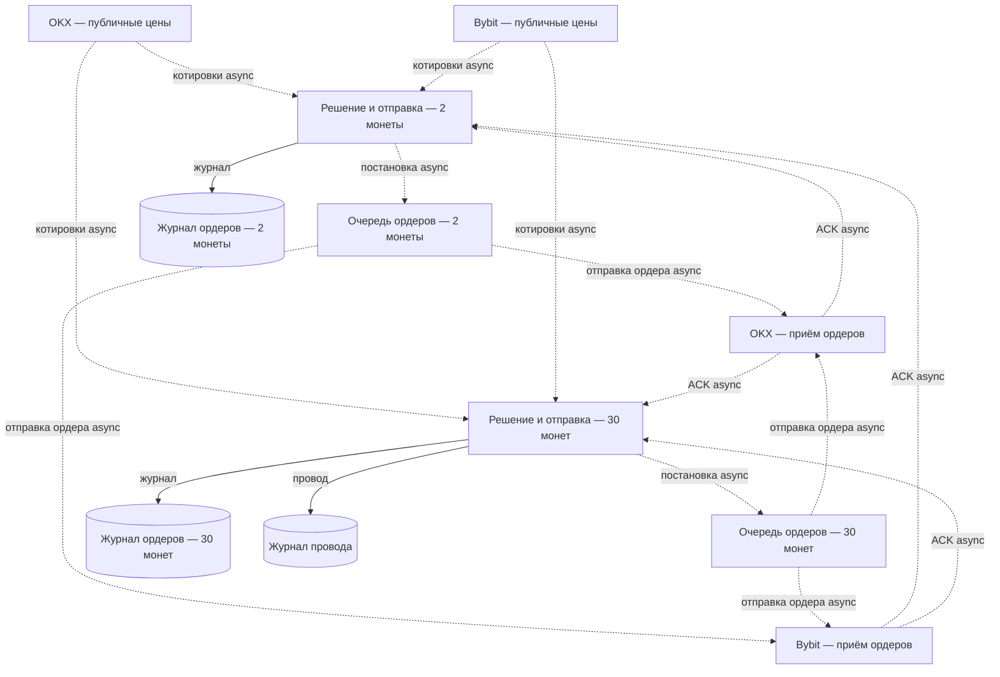

# Contour — Live send (mermaid)

Lite title: **Contour — Live send** (key `b-live-send`). Two templates; do not share one process.

Legend: solid = sync, dashed = async/event. Pipe = in-process order queue.

