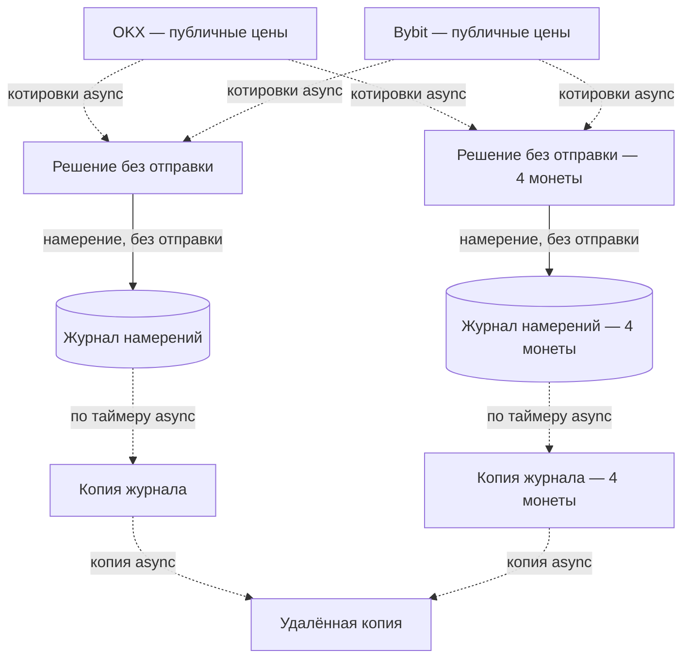

# Contour — Stub B (mermaid)

Lite title: **Contour — Stub B** (key `b-stub`).

Legend: solid = sync, dashed = async/event. Two processes, same shape.

```mermaid
flowchart TB
  okxPub[OKX — публичные цены]
  bybitPub[Bybit — публичные цены]
  stub[Решение без отправки]
  stubJ[(Журнал намерений)]
  stubB[Копия журнала]
  g2[Решение без отправки — 4 монеты]
  g2J[(Журнал намерений — 4 монеты)]
  g2B[Копия журнала — 4 монеты]
  remote[Удалённая копия]

  okxPub -.->|котировки async| stub
  bybitPub -.->|котировки async| stub
  stub -->|намерение, без отправки| stubJ
  stubJ -.->|по таймеру async| stubB
  stubB -.->|копия async| remote
  okxPub -.->|котировки async| g2
  bybitPub -.->|котировки async| g2
  g2 -->|намерение, без отправки| g2J
  g2J -.->|по таймеру async| g2B
  g2B -.->|копия async| remote
```
