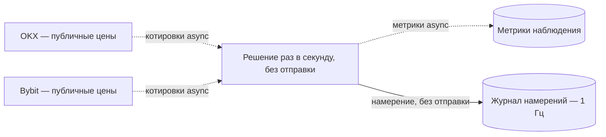

# Contour — Canary B (mermaid)

Lite title: **Contour — Canary B** (key `b-theta-would-send`). Unit file not in git.

Legend: solid = sync, dashed = async/event.

```mermaid
flowchart LR
  okxPub[OKX — публичные цены]
  bybitPub[Bybit — публичные цены]
  bot[Решение раз в секунду, без отправки]
  metrics[(Метрики наблюдения)]
  journal[(Журнал намерений — 1 Гц)]

  okxPub -.->|котировки async| bot
  bybitPub -.->|котировки async| bot
  bot -.->|метрики async| metrics
  bot -->|намерение, без отправки| journal
```
