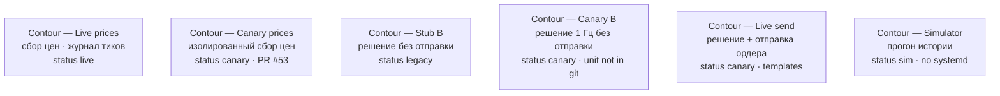

# Contour comparison (mermaid)

Not a mixed-topology container view. Boxes are the six confirmed views. Open one Level 2 diagram at a time.

| View | contour-id | status |
|---|---|---|
| Contour — Live prices | d-live | live |
| Contour — Canary prices | d-hotadd-canary | canary |
| Contour — Stub B | b-stub | legacy |
| Contour — Canary B | b-theta-would-send | canary |
| Contour — Live send | b-live-send | canary |
| Contour — Simulator | m-sim | sim |

Do not overlay Live prices and Canary prices. Human **Canary B** ≠ architecture.md “Contour B” (that name is the live send path).
