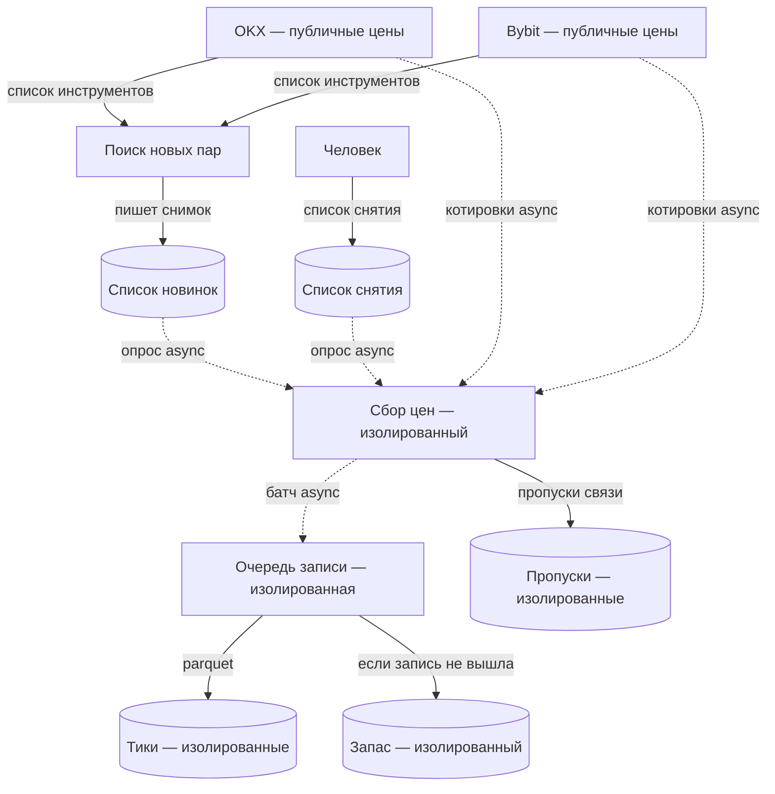

# Contour — Canary prices (mermaid)

Lite title: **Contour — Canary prices** (key `d-hotadd-canary`). Topology from PR #53 only.

Legend: solid = sync, dashed = async/event.

```mermaid
flowchart TB
  human[Человек]
  okxPub[OKX — публичные цены]
  bybitPub[Bybit — публичные цены]
  disc[Поиск новых пар]
  delta[(Список новинок)]
  drop[(Список снятия)]
  collector[Сбор цен — изолированный]
  q[Очередь записи — изолированная]
  ticks[(Тики — изолированные)]
  spool[(Запас — изолированный)]
  gaps[(Пропуски — изолированные)]

  okxPub -->|список инструментов| disc
  bybitPub -->|список инструментов| disc
  disc -->|пишет снимок| delta
  human -->|список снятия| drop
  delta -.->|опрос async| collector
  drop -.->|опрос async| collector
  okxPub -.->|котировки async| collector
  bybitPub -.->|котировки async| collector
  collector -.->|батч async| q
  q -->|parquet| ticks
  q -->|если запись не вышла| spool
  collector -->|пропуски связи| gaps
```
