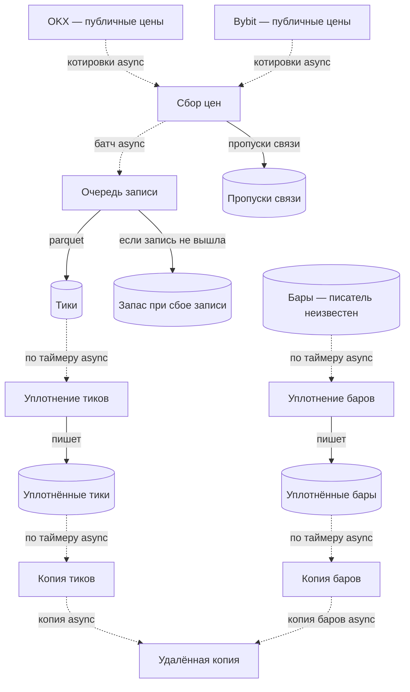

# Contour — Live prices (mermaid)

Lite title: **Contour — Live prices** (key `d-live`).

Legend: solid = sync, dashed = async/event. Pipe = in-process queue.

```mermaid
flowchart TB
  okxPub[OKX — публичные цены]
  bybitPub[Bybit — публичные цены]
  collector[Сбор цен]
  q[Очередь записи]
  ticks[(Тики)]
  spool[(Запас при сбое записи)]
  gaps[(Пропуски связи)]
  compact[Уплотнение тиков]
  compacted[(Уплотнённые тики)]
  backup[Копия тиков]
  remote[Удалённая копия]
  bars[(Бары — писатель неизвестен)]
  barsC[Уплотнение баров]
  barsOut[(Уплотнённые бары)]
  barsB[Копия баров]

  okxPub -.->|котировки async| collector
  bybitPub -.->|котировки async| collector
  collector -.->|батч async| q
  q -->|parquet| ticks
  q -->|если запись не вышла| spool
  collector -->|пропуски связи| gaps
  ticks -.->|по таймеру async| compact
  compact -->|пишет| compacted
  compacted -.->|по таймеру async| backup
  backup -.->|копия async| remote
  bars -.->|по таймеру async| barsC
  barsC -->|пишет| barsOut
  barsOut -.->|по таймеру async| barsB
  barsB -.->|копия баров async| remote
```
