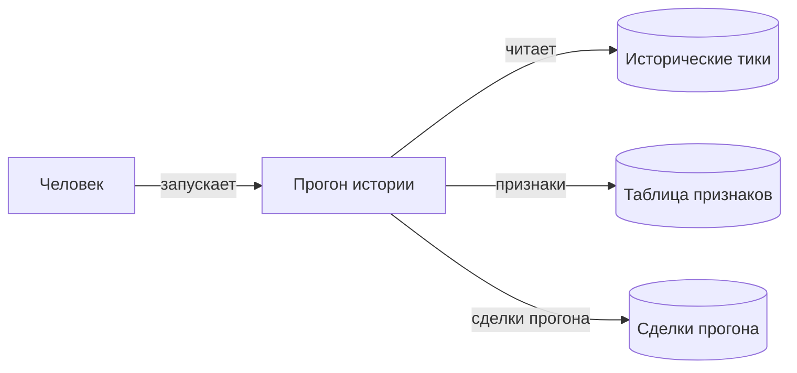

# Contour — Simulator (mermaid)

Lite title: **Contour — Simulator** (key `m-sim`).

Legend: solid = sync. No exchange dashed lines: history is already on disk.

```mermaid
flowchart LR
  human[Человек]
  replay[Прогон истории]
  hist[(Исторические тики)]
  feat[(Таблица признаков)]
  trades[(Сделки прогона)]

  human -->|запускает| replay
  replay -->|читает| hist
  replay -->|признаки| feat
  replay -->|сделки прогона| trades
```
