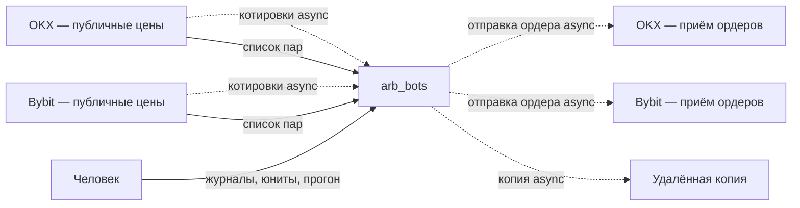

# System Context (mermaid)

Lite title: **System Context**. Union of capabilities — not one running contour.

Legend: solid = sync, dashed = async/event.

```mermaid
flowchart LR
  human[Человек]
  arb[arb_bots]
  okxPub[OKX — публичные цены]
  bybitPub[Bybit — публичные цены]
  okxOrd[OKX — приём ордеров]
  bybitOrd[Bybit — приём ордеров]
  remote[Удалённая копия]

  okxPub -.->|котировки async| arb
  bybitPub -.->|котировки async| arb
  okxPub -->|список пар| arb
  bybitPub -->|список пар| arb
  arb -.->|отправка ордера async| okxOrd
  arb -.->|отправка ордера async| bybitOrd
  arb -.->|копия async| remote
  human -->|журналы, юниты, прогон| arb
```
