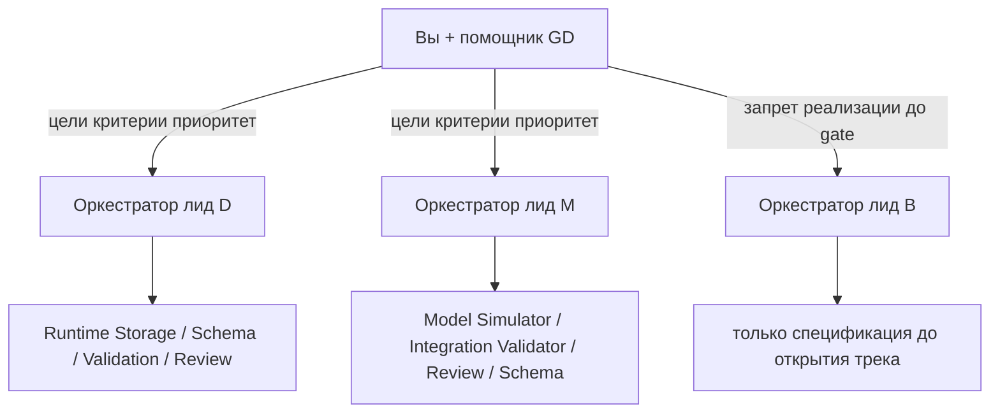

# Программная дорожная карта (GD)

Живой документ управления проектом. Обновляется при смене приоритета недели или приёмке работы.

Связанные источники смысла (не дублировать здесь лестницу гиров и forensics целиком):

- Лестница гиров модели: [`docs/strategy-gears.md`](strategy-gears.md)
- Запрос данных модели: [`docs/data-format-model.md`](data-format-model.md), [`docs/model-data-sources.md`](model-data-sources.md)
- Unattended readiness: [`docs/unattended-readiness-20260805.md`](unattended-readiness-20260805.md)
- Vacation forensics (OOM compactor → нет retention → ENOSPC): [`docs/vacation-break-forensics-20260810.md`](vacation-break-forensics-20260810.md)
- Возврат с отпуска: [`docs/vacation-return-20260810.md`](vacation-return-20260810.md)
- Эксперименты по задержкам: [`docs/latency-screener-vs-ping-experiment.md`](latency-screener-vs-ping-experiment.md), [`docs/latency-root-cause-experiments.md`](latency-root-cause-experiments.md), дашборд E0: [`docs/latency-e0-dashboard.md`](latency-e0-dashboard.md)
- Агенты и маршрутизация: [`.cursor/agents/orchestrator.md`](../.cursor/agents/orchestrator.md)
- **Current production VPS (as of 2026-08-10):** `root@38.180.94.108` (was `root@38.244.198.42`)

Статусы задач: `blocked` | `in_progress` | `gate_pending` | `done`.

---

## 1. Цель бота

Кросс-биржевой арбитраж на **редких аномальных** режимах: публичный сбор спредов → исторический скринер режима по волатильности/объёму → фиксированная модель сделки под гейтом скринера → (позже) политика размера и поиск параметров → (ещё позже) склейка с живым исполнением.

Решение «скринить все спреды или только самые волатильные» в **живом** контуре по-прежнему зависит от задержки/ёмкости публичного сбора. Историческая метрика Top‑N уже канон: soft short blend `α≈0.75` ([`regime-metrics-v0.md`](regime-metrics-v0.md)).

Блок-схему боевой стратегии и private WebSocket **не** начинаем, пока не закрыты gate перед треком (B).

---

## 2. Операционная модель



| Роль | Делает | Не делает |
|------|--------|-----------|
| **Вы + помощник (GD)** | Цель бота, приоритет недели, критерии готовности, открытие/закрытие трека, приёмка вердиктов | Реализацию кода вместо лида |
| **Оркестратор трека (лид)** | Одна задача → один реализующий агент → независимый gate; отчёт в 8 блоках | Смену приоритетов GD; правку чужих файлов |
| **Специализированный агент** | Узкая работа в своей зоне владения | Открытие соседнего трека; «тихий» фикс вне scope |

Правила:

- Один активный чат = одна цель в одном треке. GD-чат — только дорожная карта и приёмка. Внутри (D) допустим временный сплит на compaction/backup и latency при непересекающемся ownership файлов.
- На этапе реализации один файл — один реализующий агент.
- Проверяющие агенты не чинят патч, который оценивают.
- WebSocket ingest, парсинг, расчёт спреда и торговая логика заморожены без явного unlock.
- Локальный успех ≠ VPS; VPS без доказательства durable storage ≠ готовность.
- Маршрутизация моделей субагентов (Task `model`): см. секцию **Preferred models** в [`.cursor/agents/orchestrator.md`](../.cursor/agents/orchestrator.md). GD-чат по умолчанию — `cursor-grok-4.5-high-fast`.

Соответствие треков фото ↔ репозиторий:

| Фото | Репозиторий | Лид | Агенты |
|------|-------------|-----|--------|
| **(D)** | Трек 1: сбор и хранение | Orchestrator | Runtime Storage, Schema Contract, Validation, Review Critic |
| **(M)** | Трек 2: историческая модель | Orchestrator | Model Simulator, Integration Validator, Review Critic; Schema при handoff данных |
| **(B)** | Трек 3: склейка / live | Orchestrator как архитектор | До спецификации и закрытия gate — **без реализации** |

---

## 3. Gate перед треком (B)

Любая реализация private WebSocket, order routing или боевой блок-схемы **запрещена**, пока не закрыты все три пункта:

| # | Gate | Критерий done | Статус |
|---|------|---------------|--------|
| 1 | Природа высоких задержек входящих данных | Измеримые хвосты (p95/хвост) и классификация слоя (сеть / parse / event-loop / publish) в сравнении с ping-скриптами; не «кажется нормально» | `in_progress` — r1 A/B/C `measurement-limited`; planned raw r2 artifacts ещё не проверены. Production verdict запрещён: [`pre-production gap dashboard`](latency-pre-production-gap-dashboard.md), [`r2 status`](latency-ws-fanout-three-arm-r2-results.md), [`контракт приёмки`](latency-production-acceptance-contract.md) |
| 2 | Прототип стратегии на бэктесте в модельной ветви | Закрытый гир 1.0 + закрытый скринер гира 1.5 на истории; baseline 1.0 не сломан | `done` — гир 1.0 закрыт; гир 1.5 закрыт как скринер более волатильных монет (soft short blend `α≈0.75`, Top‑N / кластер); `regime_on` не критерий закрытия 1.5 ([`strategy-gears.md`](strategy-gears.md), [`regime-metrics-v0.md`](regime-metrics-v0.md)) |
| 3 | Автономный устойчивый публичный контур | Collector + compaction + backup без повторения vacation-класса: OOM compactor → остановка `archive_retention` → ENOSPC; алерты и доказанный free disk | `in_progress` — первопричина в [`vacation-break-forensics-20260810.md`](vacation-break-forensics-20260810.md); hardening ещё не закрыт |

Блок-схему рабочей стратегии (B) рисуем **после** устаканивания (D)+(M). Модельные схемы до этого валидируем параметрами симулятора, не private WS.

---

## 4. Треки и статусы

### (D) Сбор, VPS, задержки, данные

| Задача | Статус | Owner / gate | Доказательства / заметки |
|--------|--------|--------------|--------------------------|
| Скрипт сбора на VPS + сохранение / backup | `in_progress` | Runtime Storage → Validation | Production entrypoint `app/screaner_b_o.py`; unattended: [`unattended-readiness-20260805.md`](unattended-readiness-20260805.md) |
| Ошибки эксперимента во время отпуска | `gate_pending` | Runtime Storage → Review Critic → Validation | Forensics: OOM `spread-compactor` с 2026-08-07 → нет archive retention → рост `/data/live` → ENOSPC 2026-08-10. Следующий шаг: hardening памяти/chunking + alert на silence retention + disk free |
| Редкие высокие задержки vs ping | `in_progress` | Validation (измерение); ingest frozen | Не переписывать WS; классифицировать слой |
| Backtest-данные в текущем формате для модели | `in_progress` | Schema Contract → Validation; Model только читает | Lean/bars; см. [`data-format-model.md`](data-format-model.md), [`storage-contract.md`](storage-contract.md) |

### (M) Модель и скринер аномалий

| Задача | Статус | Owner / gate | Доказательства / заметки |
|--------|--------|--------------|--------------------------|
| Гир 1.0 | `done` | — | Закрыт в [`strategy-gears.md`](strategy-gears.md) |
| Метрика аномалий + прототип скринера | `done` (канон score) | Model Simulator → Integration Validator | Канон: soft short blend `(α·EMA+(1−α)·MA)/MA_long`, `α≈0.75`; Top‑N кластер (crypto default); код `research/regime_ma_ratio.py` + heatmap/CLI; [`regime-metrics-v0.md`](regime-metrics-v0.md). **Без** оптимизации PnL |
| Гир 1.5 | `done` | — | Закрыт: скринер более волатильных монет (Top‑N / кластер, blend `α≈0.75`). `regime_on` — опция позже, не критерий закрытия |
| Гир 2 | `blocked` | 1.5 закрыт; каркас не начат | Мультимонета; возможности в кластере 1.5; `K` слотов |
| Гир 2.5 | `blocked` | ждёт 2 | Политика размера |
| Гир 3 | `blocked` | ждёт 2–2.5 + каталог эпизодов | Поиск параметров |

### (B) Склейка / боевая стратегия

| Задача | Статус | Owner / gate | Доказательства / заметки |
|--------|--------|--------------|--------------------------|
| Блок-схема рабочей стратегии | `blocked` | GD + Orchestrator (spec-only) | После закрытия gate §3 |
| Тест private WebSocket | `blocked` | — | Запрещено до gate §3 и отдельной спецификации трека 3 |

---

## 5. Текущий WIP

Максимум **одна** реализация на зону владения. Трек **(D)** временно можно вести двумя чатами с непересекающимися файлами (не отдельные git-ветки и не новые треки).

| Трек / чат | Активная цель | Запрещено рядом |
|------------|---------------|-----------------|
| **(D) compaction/backup** | Hardening после vacation: compactor OOM / retention / disk / backup_transfer | Latency-патчи; private WS; ingest |
| **(D) latency** | Измерение хвостов vs ping; классификация слоя | `compactor.py`, `backup_transfer.py`, retention reclaim; private WS; переписывание ingest |
| **(M)** | Гир 2: мультимонета в кластере закрытого скринера 1.5 | Гиры 2.5 / 3; оптимизация PnL скринера; смена канона метрики без docs; `regime_on` как долг закрытия 1.5 |
| **(B)** | Нет реализации | Любой код исполнения |

Обновление WIP: править эту таблицу при старте новой задачи; старую либо `done`/`gate_pending`, либо явно отложить.

---

## 6. Ближайший горизонт (2–3 недели)

Порядок предпочтения (пункты 1 и 2 по (D) можно вести параллельно в разных чатах):

1. **(D) compaction/backup** — vacation → fix plan: memory/chunking compactor, alert на отсутствие `archive_retention_complete`, disk free. Gate: Validation + Review Critic.
2. **(D) latency** — production vs ping; числа по слоям. Ingest frozen. Gate: Validation.
3. **(M)** каркас гира 2: мультимонета вокруг чёрного ящика 1.0 в кластере скринера 1.5; Integration Validator проверяет, что гир 1.0 при выключенных новых флагах не регрессирует.
4. **(D)/(M)** handoff backtest-данных: Schema Contract + Validation читаемости parquet; Model Simulator только потребляет.

Не стартовать одновременно гиры 2 / 2.5 / 3. Не стартовать private WS.

---

## 7. Ритуал GD (еженедельно, 15–30 мин)

1. Что закрыто с доказательством?
2. Что блокирует цель бота?
3. Какой один следующий эксперимент/патч на (D) и на (M)?
4. Что явно **не** делаем (anti-scope)?

### Шаблон постановки лиду

```text
Трек: D | M | B(spec-only)
Цель недели: ...
Среда: local / VPS / backup
Заморожено: ingest/parsing/spread/trading
Реализующий агент: ...
Gate: ...
Критерий done: наблюдаемый факт, не ощущение
Запрещено: ...
```

### Шаблон приёмки GD

```text
Вердикт: принять / принять с условиями / блокер
Доказательство: путь к отчёту / метрикам / parquet smoke
Непроверенные риски: ...
Следующий разрешённый шаг: ...
```

---

## 8. Журнал приёмки

| Дата | Трек | Задача | Вердикт | Ссылка |
|------|------|--------|---------|--------|
| 2026-08-15 | M | Гир 1.5 | принять (закрыт как скринер кластера; `regime_on` не критерий) | [`strategy-gears.md`](strategy-gears.md), [`regime-metrics-v0.md`](regime-metrics-v0.md) |
| 2026-08-10 | D | Vacation break forensics | принять (диагноз); hardening — следующий шаг | [`vacation-break-forensics-20260810.md`](vacation-break-forensics-20260810.md) |
| 2026-08-05 | D | Unattended readiness | принять с условиями | [`unattended-readiness-20260805.md`](unattended-readiness-20260805.md) |
| — | M | Гир 1.0 | принять (закрыт) | [`strategy-gears.md`](strategy-gears.md) |

Новые приёмки добавлять строкой сверху таблицы после вердикта GD.

---

## 9. Anti-scope

- Не открывать (B) реализацией до закрытия трёх gate §3.
- Не оптимизировать PnL в скринере 1.5.
- Не прыгать к гиру 3 без каталога независимых аномальных эпизодов.
- Не выдавать короткий исторический прогон за торговое преимущество.
- Не считать local smoke доказательством VPS/backup.
- Не удалять backlog / truncate logs / менять mount без явного разрешения.
