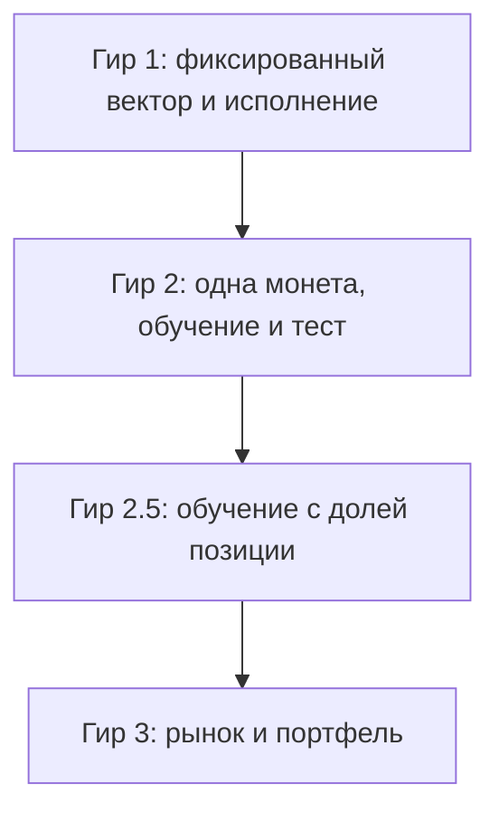

# Дорожная карта гиров стратегии

## Назначение

Этот документ задаёт лестницу уровней кросс-биржевого арбитража по спреду. Каждый **гир** — это цельный **боевой** уровень стратегии: чем выше цифра, тем шире охват рынка, выше адаптивность и устойчивость решений, и тем выше сложность реализации, данных и проверки.

В репозитории параллельно живут два фокуса:

1. надёжность сбора и хранения данных (среда исполнения, монтирование, запись);
2. стратегическая модель и её усложнение по гирам (этот документ).

Они не подменяют друг друга. Здесь — только стратегический трек.

Опорный код: `model.ipynb`. Сборщик спредов: `app/screaner_b_o.py`. Исторические ряды — файлы `parquet` по монете и дню.

### Словарь (не путать)

| Термин | Смысл |
|--------|--------|
| Доля усреднения | Множители `open_frac` / `close_frac`: среднее спреда в окне должно быть не ниже доли от порога |
| Доля позиции | Доля капитала/номинала в сделке (`position_frac`): насколько большим размером входим |
| Вес в портфеле | Доля капитала между **разными** монетами (гир 3) |
| Сигнальный фундамент | Прогон правил и гейтов **без** обязательного слоя исполнения; снимок в репозитории |
| Закрытый гир 1 | Сигналы + слой исполнения + **зафиксированный** вектор + контракт боевого контура |

---

## Лестница сложности

С ростом номера гира одновременно растут четыре оси:

| Ось | Гир 1 | Гир 2 | Гир 2.5 | Гир 3 |
|-----|-------|-------|---------|-------|
| Охват | Одна монета, фиксированные правила | Одна монета, подбор на участке обучения | Одна монета, обучение с управлением долей позиции | Весь доступный рынок, портфель |
| Адаптивность | Вектор параметров зафиксирован | Поиск в пространстве вариации (пороги и доли усреднения) | Обучение/адаптация **доли позиции** и связанных правил | Совместный выбор монет и объёмов |
| Данные и риск подгонки | Мало степеней свободы | Высокий риск подгонки под историю одной монеты | Ещё выше: размер усиливает переобучение | Максимальный: много монет и связей |
| Операционная сложность | Симулятор исполнения → один боевой контур | Плюс протокол обучения/теста | Плюс управление размером | Плюс распределение портфеля и лимиты |

**Как читать цифру гира:** это заявленный уровень зрелости боевой стратегии, а не «версия файла». Переход на следующий гир — только после критериев готовности предыдущего.

**Охват vs проверка:** стратегия гиров 1–2.5 всегда крутится в контуре **одной** монеты. Прогоны на нескольких монетах/днях для санитарной проверки логики **не** повышают номер гира и не превращают контур в портфель.

---

## Гир 1 — фиксированная стратегия

### Смысл

Боевой уровень с **заранее выбранным** вектором параметров. Правила прозрачны, воспроизводимы и одинаковы в симуляторе на истории и в боевом боте. Нет обучения и нет поиска по истории ради лучшей цифры на отложенном участке.

### Слои на бумаге (даже пока один `model.ipynb`)

1. **Сигнал и гейты** — пороги, усреднение, свежесть/задержка.
2. **Исполнение** — задержка сигнала→сделка, объём стакана, комиссии, доля позиции.
3. **Отчёт и демонстрация** — сравнение режимов, графики, счётчики отсевов.
4. **Позже (гир 2)** — протокол поиска **снаружи** чёрного ящика прогона; не смешивать с критериями закрытия гира 1.

Запрет: заготовки перебора/обучения в ноутбуке не считать признаком готовности гира 1.

### Уже есть в коде (сигнальный фундамент + задел исполнения)

- Сигнальный прогон по `spread_long` / `spread_short`.
- Гейты свежести и задержки; усреднение по временному окну с долей от порога.
- Контракт: **вариация** (пороги, `open_frac` / `close_frac`) vs **замороженные** настройки гейтов (потолки задержки по биржам, ширина окна, при необходимости свежесть).
- Задел слоя исполнения (включается явно): доля позиции, ставка комиссии, минимум объёма в стакане на вход, задержка исполнения в тиках или миллисекундах.
- Обёртка `run_backtest` / `run_backtest_from_params`, счётчики отсевов, окна задержки вокруг сигнала, демонстрация сравнения режимов.

Сигнальный фундамент в репозитории **не равен** закрытому гиру 1.

### Инварианты закрытого гира 1

- Доля позиции — только **зафиксированная** настройка исполнения, не предмет поиска.
- Доли усреднения входят в фиксированный боевой вектор (вместе с порогами) либо явно заморожены рядом с ним — без обучения.
- Гиперпараметры гейтов на время боевого контура заморожены.
- Упрощения симуляции (например, проверка объёма на тике сигнала, а не на тике исполнения) — задокументированы.

### Что ещё нужно, чтобы закрыть гир 1

1. Выбрать и зафиксировать **боевой профиль** исполнения (какие ручки включены и с какими значениями).
2. Зафиксировать **один боевой вектор** вариации и набор гиперпараметров.
3. Оформить **контракт встраивания в боевой контур:** совпадают пороги, доли усреднения, гейты A/B и обязательные ручки исполнения; расхождения допустимы только в фактическом исполнении на бирже — и перечислены явно.
4. Санитарные прогоны на нескольких днях (при необходимости — на нескольких монетах как проверка кода), без заявления о торговом преимуществе.

### Вне гира 1

- Обучение и перебор параметров с целью «выиграть» на отложенном участке.
- Оптимизация доли позиции (это гир 2.5).
- Портфель из нескольких монет.
- Утверждения о прибыльности на малой выборке.

---

## Гир 2 — подбор на одной монете

### Смысл

Боевой уровень, где прогон **закрытого** гира 1 — чёрный ящик, а сверху — **протокол поиска** параметров вариации на участке обучения и честной оценки на участке теста. Контур — **одна монета**.

### Вход

Закрытый гир 1 по критериям выше.

### Что входит

- Разбиение истории по времени: обучение → тест (без подглядывания вперёд).
- Поиск только в пространстве вариации гира 1: пороги и доли **усреднения**.
- **Запрет:** в гире 2 доля **позиции** не подбирается и не обучается (остаётся константой профиля исполнения).
- Гиперпараметры гейтов на этапе поиска заморожены либо меняются только в отдельном явном этапе протокола (сначала группа настроек гейтов, затем пороги) — не «всё сразу без отчёта».
- Отчёт: качество на тесте, устойчивость между окнами, доля отсеянных сигналов; издержки исполнения из гира 1 включены.

### Вне гира 2

- Одновременная оптимизация по многим монетам.
- Объявление победителя поиска готовой прибыльной стратегией без дисциплины теста.

---

## Гир 2.5 — обучение с долевыми позициями

### Смысл

Отдельный боевой уровень, а не «ещё один параметр в поиске гира 2». Здесь появляется **обучаемая или адаптируемая политика размера**: доля позиции — главная новая степень свободы; правила/параметры могут подстраиваться на истории с обязательной проверкой на отложенном участке. Контур — одна монета (мост к портфелю, но ещё не рынок).

### Вход

Закрытый гир 2: честный протокол обучение/тест для порогов и долей усреднения уже работает; доля позиции до этого была константой.

### Чем отличается от гира 2

| | Гир 2 | Гир 2.5 |
|---|--------|---------|
| Что ищем/учим | Пороги, доли усреднения | Политика **доли позиции** (+ связанные ограничения риска) |
| Риск | Подгонка частоты сделок | Подгонка размера под шум истории |
| Проверка | Тест по правилам гира 1 | Отдельный отчёт по риску размера и просадке |

### Вне гира 2.5

- Распределение капитала сразу по десяткам монет (гир 3).
- Отключение симуляции исполнения гира 1.

---

## Гир 3 — рынок и портфель

### Смысл

Дальняя цель лестницы: оценка всего доступного рынка, совместный выбор монет и весов объёма в согласованном пространстве степеней свободы по многим инструментам. Идеи родственны гирам 1–2.5, но масштаб — многомонетный.

### Вход (единое требование)

Устойчивые контуры **гира 1**, **гира 2** и **гира 2.5** на отдельных монетах; понятные лимиты риска; сопоставимые ряды по рынку. Без закрытых 1 → 2 → 2.5 старт гира 3 запрещён.

### Вне текущего горизонта работ

Реализация гира 3 не начинается в ближайшем порядке работ. Раздел нужен, чтобы не смешивать задачи портфеля с задачами одной монеты.

---

## Матрица готовности

| Гир | Уже есть (ориентир в коде) | Нужно для закрытия | Запреты |
|-----|----------------------------|--------------------|---------|
| 1 | `run_backtest`, гейты, задел исполнения, `run_backtest_from_params`, демонстрация сравнения | Боевой профиль исполнения; боевой вектор; контракт боевого контура; санитарный протокол на истории | Обучение; поиск доли позиции; портфель; «доказательство» прибыли |
| 2 | Чёрный ящик закрытого гира 1 | Разбиение обучение/тест; протокол поиска; отчёт устойчивости | Подглядывание; много монет; подбор доли позиции |
| 2.5 | Доля позиции как ручка исполнения в гире 1 | Политика размера в обучении/поиске; отчёт риска; тест не смешан с обучением | Портфель; отключение исполнения |
| 3 | — | Многомонетный контур; веса; лимиты | Старт без 1+2+2.5 |

---

## Ближайший порядок работ

Сейчас только путь **закрыть гир 1 → порог гира 2**. Прыжок к гиру 3 запрещён. Гир 2.5 — после осмысленного гира 2.

1. Зафиксировать минимальный профиль исполнения для закрытия гира 1 и явно перечислить оставшиеся упрощения симуляции.
2. Зафиксировать один боевой вектор вариации и набор гиперпараметров; оформить контракт «симулятор = правила боевого контура».
3. Санитарные прогоны на нескольких днях (код-проверка на других монетах — по необходимости), без заявления о торговом преимуществе.
4. Затем — каркас гира 2: обучение/тест и протокол поиска вокруг чёрного ящика гира 1 (без подбора доли позиции).

---

## Честность на малых данных

Пока история короткая (дни, единицы монет, мало сделок):

- любой итог целевой величины — проверка работоспособности кода и согласованности правил, **не** доказательство торгового преимущества;
- рост номера гира без роста данных увеличивает риск самообмана быстрее, чем качество решений;
- фильтры и усреднение режут артефакты задержки; улучшение целевой величины на одном дне не читать как прибыль;
- сравнение режимов — по числу сигналов, доле отсевов, удержанию и задержке на сигнале; к денежным величинам — только после комиссий и исполнения, и осторожно.

---

## Связь с ролями агентов

При работе над этим треком оркестратор разделяет:

- **стратег-критик** — логика гиров, метрики, риск подгонки;
- **улучшитель** — код, границы модулей, воспроизводимость прогона;
- **стилист текста** — язык документов: серьёзный, читаемый, без иностранных слов в русском тексте, с ясной лестницей сложности.

Сбор и хранение данных ведут агенты надёжности среды исполнения и проверки; этот документ их не подменяет.
