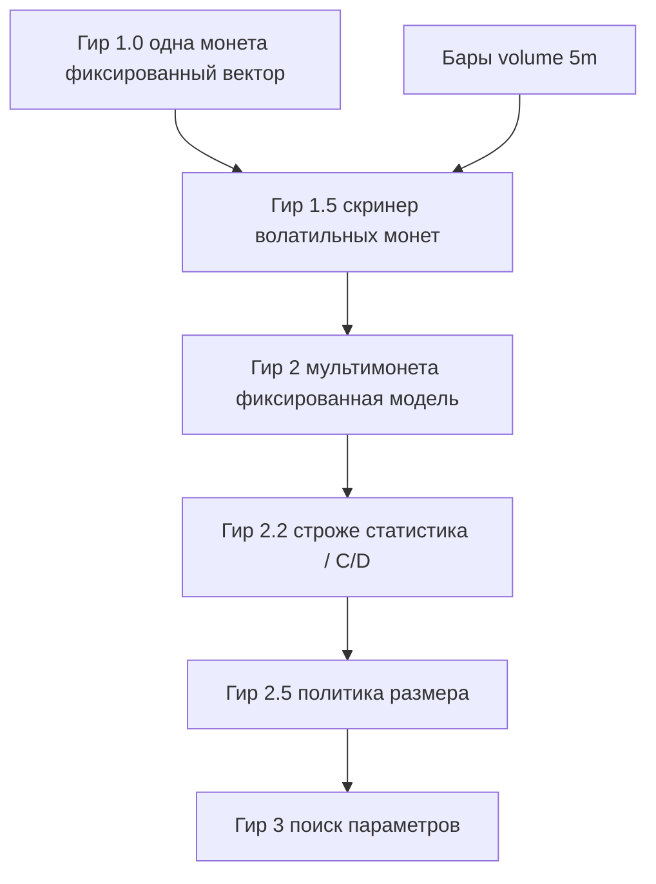

# Дорожная карта гиров стратегии

## Три трека разработки

В репозитории параллельно живут **три линии работ** (это не обязательно отдельные ветки `git`, а разные зоны ответственности):

1. **Сбор и инженерия данных** — надёжность сбора, среды исполнения, монтирования и записи. Сборщик: `app/screaner_b_o.py`. Как сейчас: основной приоритет по надёжности.
2. **Модель** (этот документ) — создание модели и её проверка на **симулированном прогоне по истории**. Проверка в этом треке — **только** симуляция на истории, не живой контур. Здесь **не** пишется асинхронный торговый бот и **не** требуется встраивание в живую торговлю: это слишком объёмно и вынесено дальше.
3. **Склейка** (будущий третий трек) — одна архитектура: сбор, история для обучения, живые метрики по моделям и сделки.

Программная дорожная карта GD (треки M/D/B, gate перед склейкой, WIP): [`docs/program-roadmap.md`](program-roadmap.md).

Трек модели ≠ боевой бот. **Гир 1.0 в треке модели закрыт:** зафиксирован воспроизводимый **симуляторный** контур. Это не развёртывание боевого бота и не трек 3 (склейка).

Опорный код модели: `model.ipynb`. Схема контура: `gear1.svg`. Исторические ряды — файлы `parquet` по монете и дню. Дорожная карта гиров: `docs/strategy-gears.md`.

### Словарь (не путать)

| Термин | Смысл |
|--------|--------|
| Доля усреднения | Множители `open_frac` / `close_frac`: среднее спреда в окне должно быть не ниже доли от порога |
| Доля позиции | Доля капитала/номинала в сделке (`position_frac`): насколько большим размером входим |
| Вес / слот капитала | В гире 2: равный кусок капитала на одновременную позицию при лимите `K` слотов (константный размер, не обучаемая политика) |
| Режим рынка | Ранг / Top‑N «горячего» кластера по волатильности mid и/или объёму свечи; выход закрытого скринера гира 1.5 |
| Сигнальный фундамент / **гир 0.8** | Исторический снимок в `git` (сигнальный прогон + гейты + задел исполнения); фундамент, на котором закрыт гир 1.0 |
| Закрытый гир 1 (**1.0**) | **Готов** в треке модели: сигналы + симуляция исполнения на истории + зафиксированный вектор + контракт симулятора + санитария + методология фильтров. Не живой контур и не трек 3 |

### Миграция смысла гира 2 (важно)

**Было (отменено):** гир 2 = поиск порогов/`open_frac`/`close_frac` на **одной** монете; гир 3 = рынок/портфель; бары `5m` тянули к политике размера (старый 2.5).

**Стало:** целевые спреды редки и режимны → сначала скринер режима по рынку (**1.5**), затем мультимонетная торговля **фиксированной** моделью 1.0 (**2**), затем **строже статистика / гипотезы** (**2.2**), затем политика размера (**2.5**), и только потом поиск в пространстве параметров по каталогу аномальных эпизодов (**3**). Бары `5m` нужны с **гира 1.5**.

---

## Назначение

Этот документ задаёт лестницу уровней кросс-биржевого арбитража по спреду. Каждый **гир** — цельный уровень зрелости **модели и её симуляторной проверки**. Стратегия рассчитана на **редкие аномальные** режимы: поэтому ширина рынка и детектор режима идут **раньше** оптимизации параметров.

Здесь — только стратегический трек (трек 2 в нумерации `AGENTS.md`). Трек сбора и трек склейки этот документ не подменяет.

---

## Лестница сложности

| Ось | Гир 1 | Гир 1.5 | Гир 2 | Гир 2.2 | Гир 2.5 | Гир 3 |
|-----|-------|---------|-------|---------|---------|-------|
| Охват | Одна монета, фиксированные правила | Скринер режима по доступному рынку | Мультимонета: long/short любыми монетами | Тот же контур 2 + stricterзы C/D, occupancy, rates | Мультимонета + политика размера | Эпизоды аномалий; поиск параметров |
| Адаптивность | Вектор зафиксирован | Пороги скринера **экспертные**, фиксированные | Тот же вектор 1.0; v0 = все crypto; кластер 1.5 — open-only флаг | Без поиска `VARIATION`; без доли позиции | Политика `position_frac` / размера | Поиск `VARIATION` (+ при нужде порогов скринера) |
| Данные и риск подгонки | Мало степеней свободы | Риск ложных «горячих» меток | Риск капитала и корреляций без обучения порогов | Риск переинтерпретации фильтров как alpha | Подгонка размера под хвосты | Подгонка порогов — только при пуле эпизодов |
| Операционная сложность | Симулятор на истории | Бары `5m` + mid; Top‑N / кластер | Лимит `K` слотов, равный капитал на слот | Протоколы C/D, honest holes, signal rates | Отчёт риска размера | Train/test по эпизодам |



**Как читать цифру гира:** заявленный уровень зрелости в симуляторном контуре, не готовность боевого бота. Переход — только после критериев готовности предыдущего.

**Охват:** гир 1 — контур **одной** монеты. С гира **1.5** охват — **рынок** (скринер), с гира **2** — мультимонетная симуляция сделок. Санитарные прогоны на нескольких днях одной монеты **не** заменяют закрытие 2.

---

## Гир 1 — фиксированная стратегия (**закрыт, 1.0**)

### Смысл

Уровень с **заранее выбранным** вектором параметров. Правила прозрачны и воспроизводимы в симуляторе на истории. Нет обучения и нет поиска по истории ради лучшей цифры на отложенном участке.

**Статус:** гир 1.0 **закрыт** в треке модели. Закрыто: воспроизводимый симуляторный контур (фиксированный вектор + симуляция исполнения на истории + санитария + методология фильтров + контракт симулятора). Снимок **0.8** остаётся фундаментом в истории `git`. Не закрыто и не требуется здесь: развёртывание бота — зона **трека 3** (склейка).

### Слои (опорный код — `model.ipynb`, схема — `gear1.svg`)

1. **Сигнал и гейты** — пороги, усреднение, свежесть/задержка.
2. **Симуляция исполнения** — задержка сигнала→сделка, объём стакана, комиссии, доля позиции (на истории).
3. **Отчёт и демонстрация** — сравнение режимов, графики, счётчики отсевов, проверка сделок.
4. **Дальше** — гир **1.5** (скринер), не поиск параметров внутри ноутбука гира 1.

Запрет: заготовки перебора/обучения в ноутбуке не повышают номер гира и не отменяют закрытие 1.0.

### Что закрыто в коде и снимке

- Сигнальный прогон по `spread_long` / `spread_short` (или из L1 при чтении).
- Гейты свежести и задержки; усреднение по временному окну с долей от порога.
- Контракт: **вариация** (пороги, `open_frac` / `close_frac`) vs **замороженные** настройки гейтов.
- Профиль симуляции исполнения: доля позиции, ставка комиссии, минимум объёма в стакане, задержка исполнения.
- Обёртка `run_backtest` / `run_backtest_from_params`, счётчики отсевов, проверка сделок (`result_gear1`).

### Инварианты закрытого гира 1 (1.0)

- Доля позиции — только **зафиксированная** настройка симуляции, не предмет поиска.
- Доли усреднения в фиксированном векторе — без обучения.
- Гиперпараметры гейтов заморожены.
- Упрощения симуляции задокументированы в контракте симулятора.

### Контракт симулятора (зафиксирован для 1.0)

1. **Явные приближения** — задержка, объём, проскальзывание, частичное исполнение и т.п.
2. **Честный прогон** — одни правила, замороженный вектор, воспроизводимые ряды, учтённые издержки.
3. **Сознательно не моделируем** — живая очередь ордеров, сетевые сбои, асинхронный бот. Зона трека склейки.

### Вне гира 1

- Поиск параметров (это **гир 3**).
- Скринер режима по рынку (это **гир 1.5**).
- Мультимонетная торговля (это **гир 2**).
- Политика размера (это **гир 2.5**).
- Утверждения о прибыльности на малой выборке.
- Живой бот (трек склейки).

---

## Гир 1.5 — скринер более волатильных монет (**закрыт**)

### Смысл

Скринер по доступным монетам на истории: на срезе `t` помечает **более волатильный кластер / Top‑N**, чтобы дальше искать возможности позиции в этом кластере (гир 2). Пороги скринера **экспертные и фиксированные**: гир 1.5 **не** оптимизирует PnL и **не** подбирает пороги сделок гира 1.

**Статус:** гир 1.5 **закрыт**. Закрыто: воспроизводимый скринер кластера (канон score — soft short blend `α≈0.75`, crypto default). **Не** критерий закрытия и **не** оставшийся блокер: булев гейт `regime_on`. Не закрыто и не утверждается здесь: попарно «выше score ⇒ строго волатильнее»; живой скринер / торговля (трек склейки); канон для equity без отдельной спеки.

**Метрика score зафиксирована** (не «на выборе»): soft short blend

```text
r_* = (α · EMA_short + (1 − α) · MA_short) / MA_long
α ≈ 0.75   # default
composite = √(r_vol · r_atr)   # default variant = geom
```

Назначение метрики — **Top‑N / кластер** волатильных монет на срезе, **не** попарное утверждение «A строго волатильнее B». Дефолт вселенной: `ASSET_CLASS=crypto`; для equity нужна отдельная доработка (сессии, неоднородность объёма/амплитуды).

Канон и формулы: [`docs/regime-metrics-v0.md`](regime-metrics-v0.md) (§ MA-ratio). Код: [`research/regime_ma_ratio.py`](../research/regime_ma_ratio.py). Интерактив (CONFIG + heatmap + Top‑10): [`research/regime_composite_heatmap.ipynb`](../research/regime_composite_heatmap.ipynb). CLI: [`research/rank_volatile_coins.py`](../research/rank_volatile_coins.py) (`--score-mode ma_ratio --numerator blend --blend-alpha 0.75`).

### Вход

Закрытый гир 1.0. Запрос данных: слой баров `5m` (`volume` + OHLC/ATR) и при необходимости mid/амплитуда офлайн из L1; см. [`docs/data-format-model.md`](data-format-model.md).

### Что входит

- Воспроизводимый расчёт канонического blend-score по рынку (история).
- Фиксированные экспертные параметры скринера (`α`, short/long, variant); ablation `ema`/`ma` — только для сравнения, не канон.
- Выход: Top‑N / кластер более волатильных монет на срезе `t` — зона, где искать возможности позиции.
- Санитария как свойство скринера: на тихом рынке почти нет «горячих» меток; на хвостах Top‑N осмыслен и стабилен при тех же правилах.

### Связка с гиром 2

Гир 2 **v0** ищет сделки модели 1.0 по **всем crypto** (`model_gear2.ipynb`). Кластер скринера 1.5 — **open-only флаг** (`USE_REGIME_TOPN`), не вселенная по умолчанию и не долг закрытия 1.5. Удержание монеты ≠ членство в кластере. Булев `regime_on` — гир **2.2**, не этот close.

### Вне гира 1.5

- Булев гейт `regime_on` поверх score (не нужен, чтобы считать 1.5 закрытым).
- Поиск порогов скринера под max-метрику (отложить к гиру 3 при необходимости).
- Политика размера позиции.
- Живой скринер как бот (трек склейки).
- Канон метрики для equity без отдельной спеки.

---

## Гир 2 — мультимонетная торговля фиксированной моделью (**закрыт (контур; 2.2 вне scope)**)

### Смысл

Применение **чёрного ящика гира 1.0** (замороженные `VARIATION` и `HYPER`) по рынку: на каждом тике — та же пороговая elif-цепочка, что у одной монеты. Охват — **все crypto** (без акций). Доля позиции — **константа** профиля (не обучаемая политика).

**Статус:** гир 2 = закрыт (контур; 2.2 вне scope). Каркас **v0** в [`model_gear2.ipynb`](../model_gear2.ipynb) + движок [`research/gear2_backtest.py`](../research/gear2_backtest.py): глобальный replay, `K=1`, elif 1.0. Блок-схема: [`gear-2-block-diagram.md`](gear-2-block-diagram.md), `gear2.svg`. **Канон счётчиков** — [`gear-2-close-20260825.md`](gear-2-close-20260825.md), не executed cells ноутбука. Доказательство = фильтры и число сигналов на 4h `2026-08-18 00:00–04:00 UTC`, `closed=0`, **не PnL**. Arm B — флаг `USE_REGIME_TOPN`, **только open**; удержание монеты ≠ членство в кластере 1.5. `pending_skip` на этой ленте **не наблюдался** (инкремент только pytest). C (`regime_on`) и D (случайный вход на частоте B) → **гир 2.2**, не этот close. `K>1` не требуется и не делался. Эталон v0 — флаг выкл. Validator 2026-08-25: **YELLOW** (таблица 1:1). Critic: accept with caveats. Alpha не утверждается.

### Вход (v0)

Закрытый гир 1.0. Ряды **полного** L1 по crypto (`is_crypto`); legacy без book не смешивать без явной пометки. Бары `5m` нужны, когда включён флаг кластера 1.5 (`USE_REGIME_TOPN`). Выключенный флаг = v0 без скринера.

### Капитал без фракционной политики

Инварианты:

- v0: `K=1` (не больше одной позиции / pending);
- дальше: не больше `K` одновременных позиций и **равный** кусок капитала на занятый слот (константный размер, не `position_frac`-политика гира 2.5).

### Что входит

- Мультимонетный симулятор: merge тиков по `event_local_ts_ms`; MA / гейты — **на монету**; fill — первый тик **той же** монеты с `ts ≥ signal + Trade_Lat`. Опционально `HYPER.reject_fill_across_gap` (по умолчанию выкл.): не fill, если `fill_ts − signal_ts > Trade_Lat + gap_fill_slack_ms` (~1 с). Эталон с выключенным флагом не меняется.
- Копия elif гира 1.0 в [`research/gear2_backtest.py`](../research/gear2_backtest.py) (ноутбук импортирует; не общий модуль с B).
- Отчёт: сделки с `base_coin`; отсевы `slot_busy`, `pending_skip`, гейты; `metric` только по closed; open_at_end отдельно.
- Накопление **каталога аномальных эпизодов** для будущего гира 3 — после того как v0 стабилен.

### Вне гира 2 / вне v0

- Поиск порогов/`open_frac`/`close_frac` (гир 3).
- Обучаемая политика размера (гир 2.5).
- Кластер Top‑N гира 1.5 как **единственная** вселенная без флага-эталона (этап 3 минимум: A vs B по отсевам; C/D — гир 2.2).
- Несколько слотов `K>1` (вне v0; для текущего close не требуется).
- Объявление прибыли без дисциплины отчёта и при редких сделках.
- Живой бот (трек склейки / B).

### Этапы закрытия (зафиксировано 2026-08-20)

Этапы **1–4** приняты 2026-08-25. Штамп: **гир 2 = закрыт (контур; 2.2 вне scope)** — без скобок фраза запрещена. Этап 0 был каркас, не закрытие. На всех этапах запрещены: поиск `VARIATION` (гир 3); политика размера (гир 2.5); выбор переключателя 1.5 по прибыли; живой бот; вывод о преимуществе с короткого ряда.

| Этап | Цель | Готово, когда | Не входит |
|------|------|----------------|-----------|
| **0** каркас v0 | Глобальный replay crypto, elif 1.0, `K=1` | [`model_gear2.ipynb`](../model_gear2.ipynb): merge по `(event_local_ts_ms, base_coin)`, MA на монету, fill той же монеты + `Trade_Lat`, `slot_busy`, `metric` только closed, чтение lean 16 колонок | Кластер 1.5, `K>1`, закрытие гира |
| **1** данные и `HYPER` | Один источник тиков и одно правило задержки | `LEAN_TICKS = output/lean_ticks`; fail-closed на чтении; дыры календаря честные ([`model-data-coverage.md`](model-data-coverage.md)); правило `max_latency_*` записано (сейчас: 95-й процентиль объединённого загруженного среза); обзорный ряд одной монеты по календарю — проверка покрытия, не метрика | Подбор порогов; смена схемы сборщика |
| **2** слоты без режима | Полный учёт занятости | `n_filtered_pending_skip`: чужие монеты с порогом open, пока `pending` (не смешивать со `slot_busy`); `K=1` без двух позиций; эталон A не ломает elif 1.0. **`K>1` не требуется** для этого close | Политика доли гира 2.5; скринер как замена эталона A |
| **3** переключатели 1.5 | Кластер как флаг, не как победитель по прибыли | **A** флаг выкл.; **B** Top‑N на open (`REGIME_TOP_N=10`, бар `[t−5м, t)` для тиков `≥ t`). Сравнение — отсевы/сигналы, [снимок 2026-08-25](gear-2-close-20260825.md). **C/D → гир 2.2** | Max-PnL как критерий ветки; обучение порогов скринера; C/D в этом close |
| **4** отчёт закрытия | Воспроизводимая приёмка | Таблица closed / open_at_end / raw / passed / `slot_busy` / pending-skip / гейты; pytest инварианты; `VARIATION`/`HYPER` заморожены как 1.0. Validator 2026-08-25 **YELLOW** (таблица 1:1); Critic accept-with-caveats. Штамп: гир 2 = закрыт (контур; 2.2 вне scope) | Каталог эпизодов (гир 3); живые заявки; прибыль |

Следующий разрешённый этап после этого close — **гир 2.2** (не 2.5 и не 3). Вход в гир 2.5 позже: мультимонета + **доступный** флаг кластера 1.5 + константный равный слот + закрытый (или явно отложенный) блок 2.2. Не читать close контура 2 как «кластер — вселенная по умолчанию»; C/D не сделаны в гире 2.

---

## Гир 2.2 — строже статистический анализ (**следующий этап**)

### Смысл

Именованная ступень лестницы **после** закрытого контура гира 2: фальсифицируемые гипотезы и статистика на том же замороженном векторе 1.0 / `HYPER`, **без** политики размера и **без** поиска `VARIATION`.

**Статус (2026-08-27):** следующий разрешённый этап Track M. Не закрыт. Live-бот позже монтируется на работу 2.2; сейчас **не** live-ready и **не** alpha.

### Что входит

- Ветки **C** (`regime_on` поверх score) и **D** (случайный вход на частоте B) — сравнение по заранее заявленным метрикам (filters, signal rates, occupancy / `slot_busy` / `pending_skip` / `not_topn`), не по short-window PnL.
- Occupancy identity, honest holes календаря, устойчивость rates на более длинных окнах.
- При необходимости `K>1` как отдельный эксперимент контура — не обязательный вход в 2.5.
- Наблюдательный **floor** (не гейт симулятора): [`gear22-floor-metric.md`](gear22-floor-metric.md) — `tf-select α25` trim-средних SMA-12 за 3h/12h. Не классификатор режима и не live-порог.

### Вне гира 2.2

- Политика доли позиции / размера (**гир 2.5**).
- Поиск `VARIATION` / оптимизация порогов (**гир 3**).
- Retune замороженных `HYPER` 1.0 без явного unlock.
- Утверждение торгового преимущества или готовности живого бота.

### Вход

Закрытый гир 2 = закрыт (контур; 2.2 вне scope). Канон счётчиков: [`gear-2-close-20260825.md`](gear-2-close-20260825.md). Покрытие данных: [`model-data-coverage.md`](model-data-coverage.md).

---

## Гир 2.5 — политика размера

### Смысл

Отдельный уровень: **обучаемая или адаптируемая** политика доли позиции / размера при уже работающем мультимонетном контуре гира 2. Пороги сделки гира 1 по-прежнему не в поиске.

### Вход

Закрытый контур гира 2 и пройденный (или явно принятый GD) блок **2.2**: мультимонета + **доступный** флаг кластера 1.5 + константный размер. Кластер не считается включённой вселенной по умолчанию. Признаки режима (бары, mid) уже есть из 1.5. Старт 2.5 **запрещён**, пока активен фокус 2.2 без явного unlock.

### Чем отличается от гира 2

| | Гир 2 | Гир 2.5 |
|---|--------|---------|
| Размер | Константа / равный слот | Политика **доли позиции** (+ лимиты риска) |
| Риск | Капитал и корреляции при фиксированном размере | Подгонка размера под шум хвостов |
| Проверка | Отчёт мультимонетного прогона | Отдельный отчёт по риску размера и просадке |

### Вне гира 2.5

- Поиск `VARIATION` (гир 3).
- Отключение симуляции исполнения гира 1.
- Старт без закрытого гира 2.

---

## Гир 3 — поиск в пространстве параметров

### Смысл

Оптимизация / подбор в пространстве вариации гира 1 (`VARIATION`: пороги, доли усреднения) и при необходимости порогов скринера 1.5. Оценка — на **каталоге аномальных эпизодов** (часто мультимонета), с разбиением обучение → тест без подглядывания. Не единственный путь — «месяц одной монеты непрерывным рядом».

### Вход

Устойчивые контуры **1.0 → 1.5 → 2 → 2.5**; понятные лимиты риска; пул сопоставимых эпизодов. Без этой цепочки старт гира 3 запрещён.

### Что входит

- Протокол поиска с честным тестом по эпизодам.
- Заморозка или явные этапы: не смешивать без отчёта поиск порогов сделки, скринера и размера.
- Отчёт устойчивости; издержки исполнения включены.

### Вне гира 3 / текущего горизонта реализации кода

Реализация поиска не начинается, пока не закрыты 2–2.5 (гир 1.5 уже закрыт). Живой бот — трек склейки, не этот гир.

---

## Матрица готовности

| Гир | Статус / уже есть | Нужно для закрытия | Запреты |
|-----|-------------------|--------------------|---------|
| 1 | **Закрыт (1.0):** `run_backtest`, гейты, профиль исполнения, фиксированный вектор, контракт симулятора, санитария, `gear1.svg` | — | Поиск параметров; скринер как замена 1.0; живой бот |
| 1.5 | **Закрыт:** скринер более волатильных монет (Top‑N / кластер); канон score — soft short blend `α≈0.75` (`regime_ma_ratio` + heatmap/CLI); [`regime-metrics-v0.md`](regime-metrics-v0.md) | — | Max-PnL подбор порогов скринера; попарно «выше score ⇒ строго волатильнее»; живая торговля; смена канона без записи в docs; `regime_on` как оставшийся блокер закрытия |
| 2 | **закрыт (контур; 2.2 вне scope):** [`model_gear2.ipynb`](../model_gear2.ipynb), pending-skip, A vs B по отсевам [`gear-2-close-20260825.md`](gear-2-close-20260825.md) (канон, не cells). Validator YELLOW; Critic accept-with-caveats | — | Поиск `VARIATION`; политика размера; прибыль на коротком ряде; C/D в этом close |
| 2.2 | **следующий этап:** stricter stats / C/D / occupancy / rates; floor-формула для наблюдения — [`gear22-floor-metric.md`](gear22-floor-metric.md) | Протоколы гипотез; честные дыры; без PnL-победителя | Политика размера (2.5); поиск `VARIATION` (3); live-ready |
| 2.5 | Константный размер в гире 2; ждёт 2.2 | Политика размера; отчёт риска; тест не смешан с подгонкой | Поиск порогов сделки; отключение исполнения; старт до 2.2 |
| 3 | — | Поиск по эпизодам; train/test; отчёт устойчивости | Старт без 2+2.2+2.5; «победитель» без теста |

---

## Ближайший порядок работ

В треке модели **гиры 1.0 и 1.5 закрыты**; **гир 2 = закрыт (контур; 2.2 вне scope)**. Гир 1.5 — скринер более волатильных монет (Top‑N / кластер, blend `α≈0.75`), не булев гейт `regime_on`. Прыжок к **2.5** или поиску параметров (**гир 3**) запрещён. Живой бот — трек склейки; монтирование на 2.2 — позже, не сейчас.

1. **Гир 2.2** (строже статистика): C (`regime_on`), D (случайный вход), occupancy / signal rates / honest holes. Не 2.5 и не 3.
2. Гир 2.5 (политика размера) — только после 2.2 или явного unlock GD.
3. Гир 3 — только при пуле аномальных эпизодов и закрытых 2–2.5.

---

## Честность на малых данных и редких аномалиях

Пока история короткая или целевые события редки:

- итог целевой величины — проверка кода и согласованности правил, **не** доказательство торгового преимущества;
- поиск параметров на одной монете при редких хвостах почти наверняка даёт шум — поэтому он отнесён к **гиру 3** и к каталогу эпизодов;
- рост номера гира без роста **числа независимых аномалий** увеличивает риск самообмана;
- сравнение режимов — по числу сигналов, доле отсевов, удержанию; к деньгам — только после комиссий и симуляции исполнения, и осторожно.

---

## Связь с ролями агентов

При работе над этим треком оркестратор разделяет:

- **стратег-критик** — логика гиров, метрики, риск подгонки;
- **улучшитель** — код, границы модулей, воспроизводимость прогона;
- **стилист текста** — язык документов: серьёзный, читаемый, без иностранных слов в русском тексте, с ясной лестницей сложности.

Сбор и хранение данных ведут агенты надёжности среды исполнения и проверки. Склейка с живым контуром — отдельно и позже. Этот документ их не подменяет.
