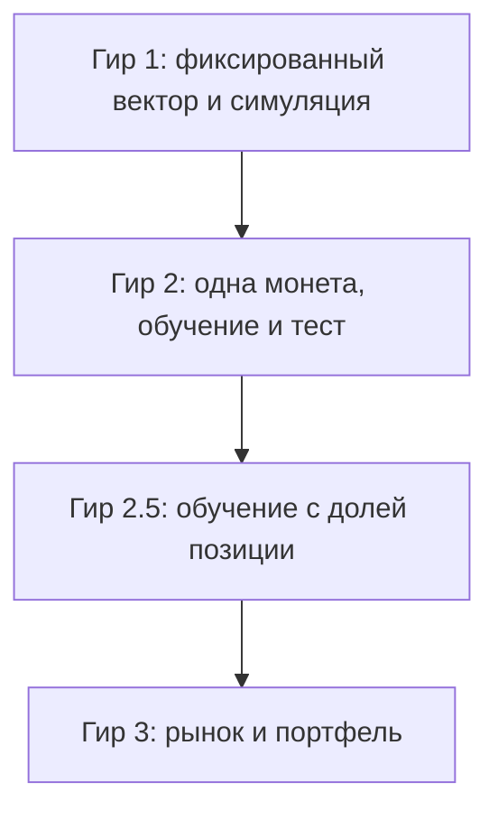

# Дорожная карта гиров стратегии

## Три трека разработки

В репозитории параллельно живут **три линии работ** (это не обязательно отдельные ветки `git`, а разные зоны ответственности):

1. **Сбор и инженерия данных** — надёжность сбора, среды исполнения, монтирования и записи. Сборщик: `app/screaner_b_o.py`. Как сейчас: основной приоритет по надёжности.
2. **Модель** (этот документ) — создание модели, обучение и подбор параметров на **симулированном прогоне по истории**. Проверка в этом треке — **только** симулированный прогон на истории, не живой контур. Здесь **не** пишется асинхронный торговый бот и **не** требуется встраивание в живую торговлю: это слишком объёмно и вынесено дальше.
3. **Склейка** (будущий третий трек) — одна архитектура: сбор, история для обучения, живые метрики по моделям и сделки.

Трек модели ≠ боевой бот. **Гир 1.0 в треке модели закрыт:** зафиксирован воспроизводимый **симуляторный** контур. Это не развёртывание боевого бота и не трек 3 (склейка).

Опорный код модели: `model.ipynb`. Схема контура: `gear1.svg`. Исторические ряды — файлы `parquet` по монете и дню. Дорожная карта гиров: `docs/strategy-gears.md`.

### Словарь (не путать)

| Термин | Смысл |
|--------|--------|
| Доля усреднения | Множители `open_frac` / `close_frac`: среднее спреда в окне должно быть не ниже доли от порога |
| Доля позиции | Доля капитала/номинала в сделке (`position_frac`): насколько большим размером входим |
| Вес в портфеле | Доля капитала между **разными** монетами (гир 3) |
| Сигнальный фундамент / **гир 0.8** | Исторический снимок в `git` (сигнальный прогон + гейты + задел исполнения); фундамент, на котором закрыт гир 1.0 |
| Закрытый гир 1 (**1.0**) | **Готов** в треке модели: сигналы + симуляция исполнения на истории + зафиксированный вектор + контракт симулятора + санитария + методология фильтров. Не живой контур и не трек 3 |

---

## Назначение

Этот документ задаёт лестницу уровней кросс-биржевого арбитража по спреду. Каждый **гир** — это цельный уровень зрелости **модели и её симуляторной проверки**: чем выше цифра, тем шире охват рынка, выше адаптивность и устойчивость решений, и тем выше сложность реализации, данных и проверки.

Здесь — только стратегический трек (трек 2). Трек 1 (сбор/хранение) и трек 3 (склейка с живым контуром) этот документ не подменяет.

---

## Лестница сложности

С ростом номера гира одновременно растут четыре оси:

| Ось | Гир 1 | Гир 2 | Гир 2.5 | Гир 3 |
|-----|-------|-------|---------|-------|
| Охват | Одна монета, фиксированные правила | Одна монета, подбор на участке обучения | Одна монета, обучение с управлением долей позиции | Весь доступный рынок, портфель |
| Адаптивность | Вектор параметров зафиксирован | Поиск в пространстве вариации (пороги и доли усреднения) | Обучение/адаптация **доли позиции** и связанных правил | Совместный выбор монет и объёмов |
| Данные и риск подгонки | Мало степеней свободы | Высокий риск подгонки под историю одной монеты | Ещё выше: размер усиливает переобучение | Максимальный: много монет и связей |
| Операционная сложность | Симулятор исполнения на истории | Плюс протокол обучения/теста | Плюс управление размером | Плюс распределение портфеля и лимиты |

**Как читать цифру гира:** это заявленный уровень зрелости модели в симуляторном контуре, а не «версия файла» и не готовность боевого бота. Переход на следующий гир — только после критериев готовности предыдущего.

**Охват vs проверка:** стратегия гиров 1–2.5 всегда крутится в контуре **одной** монеты. Прогоны на нескольких монетах/днях для санитарной проверки логики **не** повышают номер гира и не превращают контур в портфель.

---

## Гир 1 — фиксированная стратегия (**закрыт, 1.0**)

### Смысл

Уровень с **заранее выбранным** вектором параметров. Правила прозрачны и воспроизводимы в симуляторе на истории. Нет обучения и нет поиска по истории ради лучшей цифры на отложенном участке.

**Статус:** гир 1.0 **закрыт** в треке модели. Закрыто: воспроизводимый симуляторный контур (фиксированный вектор + симуляция исполнения на истории + санитария + методология фильтров + контракт симулятора). Снимок **0.8** остаётся фундаментом в истории `git`. Не закрыто и не требуется здесь: развёртывание бота, встраивание в живую торговлю — зона **трека 3**.

### Слои (опорный код — `model.ipynb`, схема — `gear1.svg`)

1. **Сигнал и гейты** — пороги, усреднение, свежесть/задержка.
2. **Симуляция исполнения** — задержка сигнала→сделка, объём стакана, комиссии, доля позиции (на истории).
3. **Отчёт и демонстрация** — сравнение режимов, графики, счётчики отсевов, проверка сделок.
4. **Дальше (гир 2)** — протокол поиска **снаружи** чёрного ящика прогона; не смешивать с уже закрытым контуром гира 1.

Запрет: заготовки перебора/обучения в ноутбуке не повышают номер гира и не отменяют закрытие 1.0.

### Что закрыто в коде и снимке

- Сигнальный прогон по `spread_long` / `spread_short`.
- Гейты свежести и задержки; усреднение по временному окну с долей от порога.
- Контракт: **вариация** (пороги, `open_frac` / `close_frac`) vs **замороженные** настройки гейтов (потолки задержки по биржам, ширина окна, при необходимости свежесть).
- Профиль симуляции исполнения (включается явно): доля позиции, ставка комиссии, минимум объёма в стакане на вход, задержка исполнения в тиках или миллисекундах.
- Обёртка `run_backtest` / `run_backtest_from_params`, счётчики отсевов, окна задержки вокруг сигнала, демонстрация сравнения режимов, проверка сделок (`result_gear1`).

### Инварианты закрытого гира 1 (1.0)

- Доля позиции — только **зафиксированная** настройка симуляции исполнения, не предмет поиска.
- Доли усреднения входят в фиксированный вектор (вместе с порогами) либо явно заморожены рядом с ним — без обучения.
- Гиперпараметры гейтов на время симуляторного контура заморожены.
- Упрощения симуляции (например, проверка объёма на тике сигнала, а не на тике исполнения) — задокументированы в контракте симулятора.

### Контракт симулятора (зафиксирован для 1.0)

Вместо контракта встраивания в боевой бот для гира 1 зафиксирован **контракт симулятора**:

1. **Явные приближения** — что симулятор упрощает относительно реальной биржи (задержка, объём, проскальзывание, частичное исполнение и т.п.).
2. **Честный прогон** — что считается допустимым симулированным прогоном (одни и те же правила, замороженный вектор, воспроизводимые входные ряды, учтённые издержки из профиля исполнения).
3. **Сознательно не моделируем** — что намеренно вне контура (живая очередь ордеров, сетевые сбои, асинхронный бот, метрики в реальном времени). Это зона трека 3, не часть закрытия гира 1.

### Вне гира 1

- Обучение и перебор параметров с целью «выиграть» на отложенном участке.
- Оптимизация доли позиции (это гир 2.5).
- Портфель из нескольких монет.
- Утверждения о прибыльности на малой выборке.
- Живая интеграция или боевой бот (трек 3) — не часть закрытого 1.0.

---

## Гир 2 — подбор на одной монете

### Смысл

Уровень, где прогон **закрытого** гира 1 — чёрный ящик, а сверху — **протокол поиска** параметров вариации на участке обучения и честной оценки на участке теста. Контур — **одна монета**. Проверка по-прежнему симулированная, на истории.

### Вход

Закрытый гир 1 по критериям выше.

### Что входит

- Разбиение истории по времени: обучение → тест (без подглядывания вперёд).
- Поиск только в пространстве вариации гира 1: пороги и доли **усреднения**.
- **Запрет:** в гире 2 доля **позиции** не подбирается и не обучается (остаётся константой профиля симуляции исполнения).
- Гиперпараметры гейтов на этапе поиска заморожены либо меняются только в отдельном явном этапе протокола (сначала группа настроек гейтов, затем пороги) — не «всё сразу без отчёта».
- Отчёт: качество на тесте, устойчивость между окнами, доля отсеянных сигналов; издержки исполнения из гира 1 включены.

### Вне гира 2

- Одновременная оптимизация по многим монетам.
- Объявление победителя поиска готовой прибыльной стратегией без дисциплины теста.

---

## Гир 2.5 — обучение с долевыми позициями

### Смысл

Отдельный уровень, а не «ещё один параметр в поиске гира 2». Здесь появляется **обучаемая или адаптируемая политика размера**: доля позиции — главная новая степень свободы; правила/параметры могут подстраиваться на истории с обязательной проверкой на отложенном участке. Контур — одна монета (мост к портфелю, но ещё не рынок).

### Вход

Закрытый гир 2: честный протокол обучение/тест для порогов и долей усреднения уже работает; доля позиции до этого была константой.

### Чем отличается от гира 2

| | Гир 2 | Гир 2.5 |
|---|--------|---------|
| Что ищем/учим | Пороги, доли усреднения | Политика **доли позиции** (+ связанные ограничения риска) |
| Риск | Подгонка частоты сделок | Подгонка размера под шум истории |
| Проверка | Тест по правилам гира 1 | Отдельный отчёт по риску размера и просадке |

### Вне гира 2.5

- Распределение капитала сразу по десяткам монет (гир 3).
- Отключение симуляции исполнения гира 1.

---

## Гир 3 — рынок и портфель

### Смысл

Дальняя цель лестницы **внутри трека модели**: оценка всего доступного рынка, совместный выбор монет и весов объёма в согласованном пространстве степеней свободы по многим инструментам. Идеи родственны гирам 1–2.5, но масштаб — многомонетный. Это по-прежнему симулятор на истории, пока не начат трек 3 (склейка).

### Вход (единое требование)

Устойчивые контуры **гира 1**, **гира 2** и **гира 2.5** на отдельных монетах; понятные лимиты риска; сопоставимые ряды по рынку. Без закрытых 1 → 2 → 2.5 старт гира 3 запрещён.

### Вне текущего горизонта работ

Реализация гира 3 не начинается в ближайшем порядке работ. Раздел нужен, чтобы не смешивать задачи портфеля с задачами одной монеты.

---

## Матрица готовности

| Гир | Статус / уже есть | Нужно для закрытия | Запреты |
|-----|-------------------|--------------------|---------|
| 1 | **Закрыт (1.0):** `run_backtest`, гейты, профиль исполнения, фиксированный вектор, контракт симулятора, санитария, `gear1.svg` | — | Обучение; поиск доли позиции; портфель; «доказательство» прибыли; требование живого бота |
| 2 | Чёрный ящик закрытого гира 1 | Разбиение обучение/тест; протокол поиска; отчёт устойчивости | Подглядывание; много монет; подбор доли позиции |
| 2.5 | Доля позиции как ручка симуляции в гире 1 | Политика размера в обучении/поиске; отчёт риска; тест не смешан с обучением | Портфель; отключение исполнения |
| 3 | — | Многомонетный контур; веса; лимиты | Старт без 1+2+2.5 |

---

## Ближайший порядок работ

В треке модели **гир 1.0 закрыт** (симуляторный контур). Следующий порог — **гир 2**. Прыжок к гиру 3 запрещён. Гир 2.5 — после осмысленного гира 2. Живой бот и склейка — **трек 3**, не часть закрытого 1.0.

1. Каркас гира 2: обучение/тест и протокол поиска вокруг чёрного ящика гира 1 (без подбора доли позиции).
2. Отчёт устойчивости на участке теста; издержки исполнения из гира 1 включены.
3. Санитарные прогоны на нескольких днях по мере роста истории — без заявления о торговом преимуществе.

---

## Честность на малых данных

Пока история короткая (дни, единицы монет, мало сделок):

- любой итог целевой величины — проверка работоспособности кода и согласованности правил, **не** доказательство торгового преимущества;
- рост номера гира без роста данных увеличивает риск самообмана быстрее, чем качество решений;
- фильтры и усреднение режут артефакты задержки; улучшение целевой величины на одном дне не читать как прибыль;
- сравнение режимов — по числу сигналов, доле отсевов, удержанию и задержке на сигнале; к денежным величинам — только после комиссий и симуляции исполнения, и осторожно.

---

## Связь с ролями агентов

При работе над этим треком оркестратор разделяет:

- **стратег-критик** — логика гиров, метрики, риск подгонки;
- **улучшитель** — код, границы модулей, воспроизводимость прогона;
- **стилист текста** — язык документов: серьёзный, читаемый, без иностранных слов в русском тексте, с ясной лестницей сложности.

Сбор и хранение данных ведут агенты надёжности среды исполнения и проверки (трек 1). Склейка с живым контуром (трек 3) — отдельно и позже. Этот документ их не подменяет.
