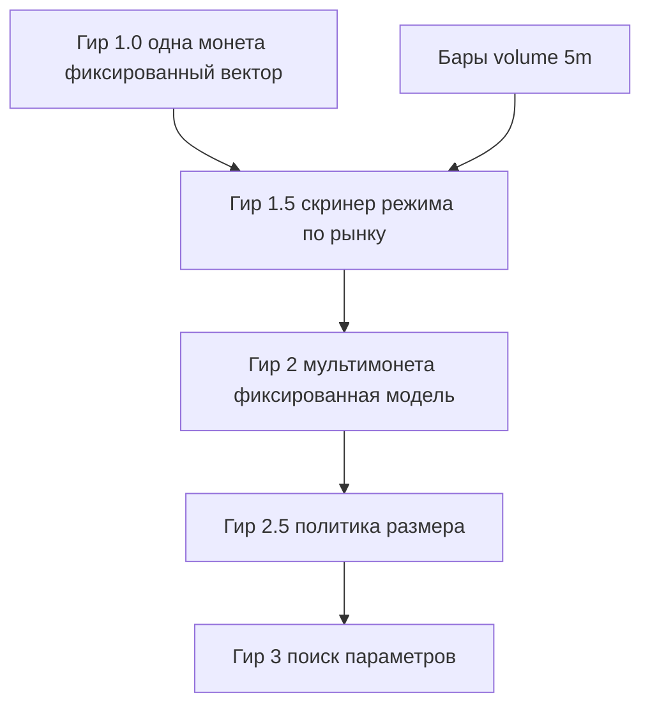

# Дорожная карта гиров стратегии

## Три трека разработки

В репозитории параллельно живут **три линии работ** (это не обязательно отдельные ветки `git`, а разные зоны ответственности):

1. **Сбор и инженерия данных** — надёжность сбора, среды исполнения, монтирования и записи. Сборщик: `app/screaner_b_o.py`. Как сейчас: основной приоритет по надёжности.
2. **Модель** (этот документ) — создание модели и её проверка на **симулированном прогоне по истории**. Проверка в этом треке — **только** симуляция на истории, не живой контур. Здесь **не** пишется асинхронный торговый бот и **не** требуется встраивание в живую торговлю: это слишком объёмно и вынесено дальше.
3. **Склейка** (будущий третий трек) — одна архитектура: сбор, история для обучения, живые метрики по моделям и сделки.

Программная дорожная карта GD (треки M/D/B, gate перед склейкой, WIP): [`docs/program-roadmap.md`](program-roadmap.md).

Трек модели ≠ боевой бот. **Гир 1.0 в треке модели закрыт:** зафиксирован воспроизводимый **симуляторный** контур. Это не развёртывание боевого бота и не трек 3 (склейка).

Опорный код модели: `model.ipynb`. Схема контура: `gear1.svg`. Исторические ряды — файлы `parquet` по монете и дню. Дорожная карта гиров: `docs/strategy-gears.md`.

### Словарь (не путать)

| Термин | Смысл |
|--------|--------|
| Доля усреднения | Множители `open_frac` / `close_frac`: среднее спреда в окне должно быть не ниже доли от порога |
| Доля позиции | Доля капитала/номинала в сделке (`position_frac`): насколько большим размером входим |
| Вес / слот капитала | В гире 2: равный кусок капитала на одновременную позицию при лимите `K` слотов (константный размер, не обучаемая политика) |
| Режим рынка | Флаг/ранг «аномального» окна по волатильности mid и/или объёму свечи; выход скринера гира 1.5 |
| Сигнальный фундамент / **гир 0.8** | Исторический снимок в `git` (сигнальный прогон + гейты + задел исполнения); фундамент, на котором закрыт гир 1.0 |
| Закрытый гир 1 (**1.0**) | **Готов** в треке модели: сигналы + симуляция исполнения на истории + зафиксированный вектор + контракт симулятора + санитария + методология фильтров. Не живой контур и не трек 3 |

### Миграция смысла гира 2 (важно)

**Было (отменено):** гир 2 = поиск порогов/`open_frac`/`close_frac` на **одной** монете; гир 3 = рынок/портфель; бары `5m` тянули к политике размера (старый 2.5).

**Стало:** целевые спреды редки и режимны → сначала скринер режима по рынку (**1.5**), затем мультимонетная торговля **фиксированной** моделью 1.0 (**2**), затем политика размера (**2.5**), и только потом поиск в пространстве параметров по каталогу аномальных эпизодов (**3**). Бары `5m` нужны с **гира 1.5**.

---

## Назначение

Этот документ задаёт лестницу уровней кросс-биржевого арбитража по спреду. Каждый **гир** — цельный уровень зрелости **модели и её симуляторной проверки**. Стратегия рассчитана на **редкие аномальные** режимы: поэтому ширина рынка и детектор режима идут **раньше** оптимизации параметров.

Здесь — только стратегический трек (трек 2 в нумерации `AGENTS.md`). Трек сбора и трек склейки этот документ не подменяет.

---

## Лестница сложности

| Ось | Гир 1 | Гир 1.5 | Гир 2 | Гир 2.5 | Гир 3 |
|-----|-------|---------|-------|---------|-------|
| Охват | Одна монета, фиксированные правила | Скринер режима по доступному рынку | Мультимонета: long/short любыми монетами | Мультимонета + политика размера | Эпизоды аномалий; поиск параметров |
| Адаптивность | Вектор зафиксирован | Пороги скринера **экспертные**, фиксированные | Тот же вектор 1.0; вход **под гейтом** 1.5 | Политика `position_frac` / размера | Поиск `VARIATION` (+ при нужде порогов скринера) |
| Данные и риск подгонки | Мало степеней свободы | Риск ложных «горячих» меток | Риск капитала и корреляций без обучения порогов | Подгонка размера под хвосты | Подгонка порогов — только при пуле эпизодов |
| Операционная сложность | Симулятор на истории | Бары `5m` + mid; флаг режима | Лимит `K` слотов, равный капитал на слот | Отчёт риска размера | Train/test по эпизодам |



**Как читать цифру гира:** заявленный уровень зрелости в симуляторном контуре, не готовность боевого бота. Переход — только после критериев готовности предыдущего.

**Охват:** гир 1 — контур **одной** монеты. С гира **1.5** охват — **рынок** (скринер), с гира **2** — мультимонетная симуляция сделок. Санитарные прогоны на нескольких днях одной монеты **не** заменяют закрытие 1.5/2.

---

## Гир 1 — фиксированная стратегия (**закрыт, 1.0**)

### Смысл

Уровень с **заранее выбранным** вектором параметров. Правила прозрачны и воспроизводимы в симуляторе на истории. Нет обучения и нет поиска по истории ради лучшей цифры на отложенном участке.

**Статус:** гир 1.0 **закрыт** в треке модели. Закрыто: воспроизводимый симуляторный контур (фиксированный вектор + симуляция исполнения на истории + санитария + методология фильтров + контракт симулятора). Снимок **0.8** остаётся фундаментом в истории `git`. Не закрыто и не требуется здесь: развёртывание бота — зона **трека 3** (склейка).

### Слои (опорный код — `model.ipynb`, схема — `gear1.svg`)

1. **Сигнал и гейты** — пороги, усреднение, свежесть/задержка.
2. **Симуляция исполнения** — задержка сигнала→сделка, объём стакана, комиссии, доля позиции (на истории).
3. **Отчёт и демонстрация** — сравнение режимов, графики, счётчики отсевов, проверка сделок.
4. **Дальше** — гир **1.5** (скринер), не поиск параметров внутри ноутбука гира 1.

Запрет: заготовки перебора/обучения в ноутбуке не повышают номер гира и не отменяют закрытие 1.0.

### Что закрыто в коде и снимке

- Сигнальный прогон по `spread_long` / `spread_short` (или из L1 при чтении).
- Гейты свежести и задержки; усреднение по временному окну с долей от порога.
- Контракт: **вариация** (пороги, `open_frac` / `close_frac`) vs **замороженные** настройки гейтов.
- Профиль симуляции исполнения: доля позиции, ставка комиссии, минимум объёма в стакане, задержка исполнения.
- Обёртка `run_backtest` / `run_backtest_from_params`, счётчики отсевов, проверка сделок (`result_gear1`).

### Инварианты закрытого гира 1 (1.0)

- Доля позиции — только **зафиксированная** настройка симуляции, не предмет поиска.
- Доли усреднения в фиксированном векторе — без обучения.
- Гиперпараметры гейтов заморожены.
- Упрощения симуляции задокументированы в контракте симулятора.

### Контракт симулятора (зафиксирован для 1.0)

1. **Явные приближения** — задержка, объём, проскальзывание, частичное исполнение и т.п.
2. **Честный прогон** — одни правила, замороженный вектор, воспроизводимые ряды, учтённые издержки.
3. **Сознательно не моделируем** — живая очередь ордеров, сетевые сбои, асинхронный бот. Зона трека склейки.

### Вне гира 1

- Поиск параметров (это **гир 3**).
- Скринер режима по рынку (это **гир 1.5**).
- Мультимонетная торговля (это **гир 2**).
- Политика размера (это **гир 2.5**).
- Утверждения о прибыльности на малой выборке.
- Живой бот (трек склейки).

---

## Гир 1.5 — скринер режима по рынку

### Смысл

Детектор **аномального режима** по доступным монетам на истории. Выход — ранг / Top‑N «горячего» кластера на срезе `t` (и далее флаг режима для гейта гира 2). Пороги скринера **экспертные и фиксированные**: гир 1.5 **не** оптимизирует PnL и **не** подбирает пороги сделок гира 1.

**Метрика score зафиксирована** (не «на выборе»): soft short blend

```text
r_* = (α · EMA_short + (1 − α) · MA_short) / MA_long
α ≈ 0.75   # default
composite = √(r_vol · r_atr)   # default variant = geom
```

Назначение метрики — **Top‑N / кластер** волатильных монет на срезе, **не** попарное утверждение «A строго волатильнее B». Дефолт вселенной: `ASSET_CLASS=crypto`; для equity нужна отдельная доработка (сессии, неоднородность объёма/амплитуды).

Канон и формулы: [`docs/regime-metrics-v0.md`](regime-metrics-v0.md) (§ MA-ratio). Код: [`research/regime_ma_ratio.py`](../research/regime_ma_ratio.py). Интерактив (CONFIG + heatmap + Top‑10): [`research/regime_composite_heatmap.ipynb`](../research/regime_composite_heatmap.ipynb). CLI: [`research/rank_volatile_coins.py`](../research/rank_volatile_coins.py) (`--score-mode ma_ratio --numerator blend --blend-alpha 0.75`).

### Вход

Закрытый гир 1.0. Запрос данных: слой баров `5m` (`volume` + OHLC/ATR) и при необходимости mid/амплитуда офлайн из L1; см. [`docs/data-format-model.md`](data-format-model.md).

### Что входит

- Воспроизводимый расчёт канонического blend-score по рынку (история).
- Фиксированные экспертные параметры скринера (`α`, short/long, variant); ablation `ema`/`ma` — только для сравнения, не канон.
- Санитария: на тихом рынке почти нет «горячих» меток; на хвостах Top‑N осмыслен и стабилен при тех же правилах.
- Дальше к закрытию гира: явный флаг/гейт `regime_on` поверх score и стыковка с гиром 2.

### Связка с гиром 2

Скринер **гейтит** вход: сделка модели 1.0 допускается только если монета/окно в режиме. Без гейта мультимонетный прогон снова торгует тишину.

### Вне гира 1.5

- Поиск порогов скринера под max-метрику (отложить к гиру 3 при необходимости).
- Политика размера позиции.
- Живой скринер как бот (трек склейки).
- Канон метрики для equity без отдельной спеки.

---

## Гир 2 — мультимонетная торговля фиксированной моделью

### Смысл

Применение **чёрного ящика гира 1.0** (замороженные `VARIATION` и `HYPER`) по **всему доступному рынку**: long/short по любым монетам, у которых полный L1 и сработал гейт режима 1.5. Доля позиции — **константа** профиля (не обучаемая политика).

### Вход

Закрытый гир 1.0 и осмысленный гир 1.5 (флаг режима + гейт входа). Периоды — ряды **полного** L1; legacy без book не смешивать без явной пометки.

### Капитал без фракционной политики

Инварианты гира 2 (зафиксировать в симуляторе при реализации):

- не больше `K` одновременных позиций;
- **равный** кусок капитала на занятый слот (константный размер, не `position_frac`-политика гира 2.5).

### Что входит

- Мультимонетный симулятор вокруг `run_backtest` / того же контракта исполнения.
- Гейт 1.5 на вход.
- Отчёт: сделки, отсевы, капитал, одновременность; издержки гира 1 включены.
- Накопление **каталога аномальных эпизодов** для будущего гира 3.

### Вне гира 2

- Поиск порогов/`open_frac`/`close_frac` (гир 3).
- Обучаемая политика размера (гир 2.5).
- Объявление прибыли без дисциплины отчёта и при редких сделках.

---

## Гир 2.5 — политика размера

### Смысл

Отдельный уровень: **обучаемая или адаптируемая** политика доли позиции / размера при уже работающем мультимонетном контуре гира 2. Пороги сделки гира 1 по-прежнему не в поиске.

### Вход

Закрытый гир 2: мультимонета + гейт 1.5 + константный размер. Признаки режима (бары, mid) уже есть из 1.5.

### Чем отличается от гира 2

| | Гир 2 | Гир 2.5 |
|---|--------|---------|
| Размер | Константа / равный слот | Политика **доли позиции** (+ лимиты риска) |
| Риск | Капитал и корреляции при фиксированном размере | Подгонка размера под шум хвостов |
| Проверка | Отчёт мультимонетного прогона | Отдельный отчёт по риску размера и просадке |

### Вне гира 2.5

- Поиск `VARIATION` (гир 3).
- Отключение симуляции исполнения гира 1.
- Старт без закрытого гира 2.

---

## Гир 3 — поиск в пространстве параметров

### Смысл

Оптимизация / подбор в пространстве вариации гира 1 (`VARIATION`: пороги, доли усреднения) и при необходимости порогов скринера 1.5. Оценка — на **каталоге аномальных эпизодов** (часто мультимонета), с разбиением обучение → тест без подглядывания. Не единственный путь — «месяц одной монеты непрерывным рядом».

### Вход

Устойчивые контуры **1.0 → 1.5 → 2 → 2.5**; понятные лимиты риска; пул сопоставимых эпизодов. Без этой цепочки старт гира 3 запрещён.

### Что входит

- Протокол поиска с честным тестом по эпизодам.
- Заморозка или явные этапы: не смешивать без отчёта поиск порогов сделки, скринера и размера.
- Отчёт устойчивости; издержки исполнения включены.

### Вне гира 3 / текущего горизонта реализации кода

Реализация поиска не начинается, пока не закрыты 1.5–2.5. Живой бот — трек склейки, не этот гир.

---

## Матрица готовности

| Гир | Статус / уже есть | Нужно для закрытия | Запреты |
|-----|-------------------|--------------------|---------|
| 1 | **Закрыт (1.0):** `run_backtest`, гейты, профиль исполнения, фиксированный вектор, контракт симулятора, санитария, `gear1.svg` | — | Поиск параметров; скринер как замена 1.0; живой бот |
| 1.5 | Канон score зафиксирован: soft short blend `α≈0.75` (`regime_ma_ratio` + heatmap/CLI); [`regime-metrics-v0.md`](regime-metrics-v0.md) | Гейт `regime_on` + санитария тихий/хвост; стыковка с гиром 2 | Max-PnL подбор порогов скринера; торговля без флага; смена канона без записи в docs |
| 2 | Чёрный ящик 1.0 | Мультимонетный симулятор; гейт 1.5; лимит `K` и равный слот; отчёт | Поиск `VARIATION`; политика размера |
| 2.5 | Константный размер в гире 2 | Политика размера; отчёт риска; тест не смешан с подгонкой | Поиск порогов сделки; отключение исполнения |
| 3 | — | Поиск по эпизодам; train/test; отчёт устойчивости | Старт без 1.5+2+2.5; «победитель» без теста |

---

## Ближайший порядок работ

В треке модели **гир 1.0 закрыт**. Метрика скринера гира **1.5 зафиксирована** (blend `α≈0.75`); до закрытия 1.5 остаются гейт `regime_on` и санитария. Прыжок к поиску параметров (гир 3) запрещён. Живой бот — трек склейки.

1. Довести гир 1.5: `regime_on` / санитария поверх канонического blend-score; handoff сборщику по слою `bar_5m`.
2. Каркас гира 2: мультимонета вокруг чёрного ящика 1.0 + гейт 1.5; `K` слотов и равный капитал.
3. После закрытия 2 — гир 2.5 (политика размера).
4. Гир 3 — только при пуле аномальных эпизодов и закрытых 1.5–2.5.

---

## Честность на малых данных и редких аномалиях

Пока история короткая или целевые события редки:

- итог целевой величины — проверка кода и согласованности правил, **не** доказательство торгового преимущества;
- поиск параметров на одной монете при редких хвостах почти наверняка даёт шум — поэтому он отнесён к **гиру 3** и к каталогу эпизодов;
- рост номера гира без роста **числа независимых аномалий** увеличивает риск самообмана;
- сравнение режимов — по числу сигналов, доле отсевов, удержанию; к деньгам — только после комиссий и симуляции исполнения, и осторожно.

---

## Связь с ролями агентов

При работе над этим треком оркестратор разделяет:

- **стратег-критик** — логика гиров, метрики, риск подгонки;
- **улучшитель** — код, границы модулей, воспроизводимость прогона;
- **стилист текста** — язык документов: серьёзный, читаемый, без иностранных слов в русском тексте, с ясной лестницей сложности.

Сбор и хранение данных ведут агенты надёжности среды исполнения и проверки. Склейка с живым контуром — отдельно и позже. Этот документ их не подменяет.
