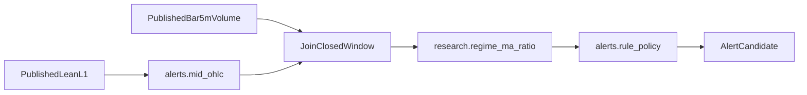

# Карта источников Telegram-скринера

## Статус

Этот документ фиксирует, какие модули старшего проекта alert-only
consumer импортирует, какие оборачивает и какие запрещены в alert path.
Он не является реализацией `alerts/` и не открывает Telegram delivery.

Первый готовый скринер — offline replay candidates. Outbox и Telegram API
остаются следующим этапом после детерминированного replay.

## Поток

Новый код пишется только в будущем `alerts/`. Frozen producer не копируется
и не меняется. Provenance корней и отклонения: [`telegram-alert-data-provenance.md`](telegram-alert-data-provenance.md).

## Reuse — импортировать, не форкать

| Модуль | Что брать | Как использовать |
|--------|-----------|------------------|
| [`research/regime_ma_ratio.py`](../research/regime_ma_ratio.py) | `MaRatioParams`, `build_ma_ratio_features`, snapshot/panel | Канон score: `numerator=blend`, `α=0.75`, `short=6`, `long=48`, `variant=geom` |
| [`research/regime_metrics.py`](../research/regime_metrics.py) | `amp_from_ticks`, `apply_hysteresis`, `regime_episodes`, `sanity_summary` | Mid amplitude из L1; гистерезис policy; каталог эпизодов. Volume-z `regime_on` — диагностика, не Telegram-порог |
| [`research/rank_volatile_coins.py`](../research/rank_volatile_coins.py) | Top-N и combine `mean\|min` | Образец ранжирования. CLI читает REST hist dump — не live-скринер |
| [`research/is_crypto.py`](../research/is_crypto.py) | `is_crypto(base_coin)` | Фильтр вселенной |
| [`app/schema/lean_event.py`](../app/schema/lean_event.py) | `LEAN_TICK_BODY_COLS`, `LEAN_BAR_5M_BODY_COLS`, `BAR_INTERVAL_MS` | Проверка published schema |
| [`docs/telegram-alert-data-provenance.md`](telegram-alert-data-provenance.md) | Один root, identity бара, canonical `okx` | Reader отклоняет mixed roots/schema и duplicate identity |

## Wrap — новый код в `alerts/`

1. Reader published lean L1 и closed `bar_5m`: явная ошибка на mixed schema,
   mixed roots, incomplete parquet, open bar.
2. Causal 5m mid-OHLC из complete L1; volume только из `bar_5m` после close
   окна `[bar_start_ts_ms, bar_end_ts_ms)`.
3. Join по `base_coin` и закрытому окну; canonical volume —
   `ref_exchange == "okx"`; identity `base_coin + ref_exchange + bar_start_ts_ms`.
4. Rule-only policy: warmup 48 баров, `theta_enter > theta_exit`, volume и
   ATR-like confirmation, cross-exchange agreement, Top-N, cooldown,
   `missing_data` / suppression без silent fallback.
5. Выход: `AlertCandidate` с `alert_id = metric_version:base_coin:t0`.
   Без outbox и без Telegram API.

## Forbid — не брать в alert path

- [`model.ipynb`](../model.ipynb), `run_backtest`, PnL и торговые гейты.
- [`app/screaner_b_o.py`](../app/screaner_b_o.py), `app/storage/*`, compaction, backup.
- [`research/regime_composite.py`](../research/regime_composite.py) как канон score: это legacy `z_rank`.
- REST OHLC dumps (`output/okx_bar5m_hist_regime/`, Bybit analog) как замена live `bar_5m`.
- Локальные untracked `regime_sanity_0g.py`, `regime_gear1_overlap_0g.py`,
  downloaders и visual notebooks: vacation/hist прототипы, не production-shaped вход.

## Первый replay — критерий done

Повторный прогон на одном versioned input manifest даёт тот же набор
candidates. Неполнота L1, volume, warmup или cross-exchange даёт
`missing_data`, а не синтетическое значение.

Следующий этап после этого gate: append-only outbox и закрытый Telegram
canary. ML `p_persist` остаётся shadow и не влияет на отправку.
