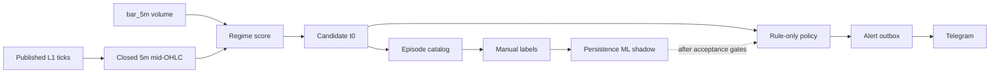

# Спецификация: Telegram-алерты аномальной волатильности

## Назначение

Подпроект сообщает русскоязычным пользователям Telegram о начале
подтверждённого аномального режима по монете на публичных данных OKX и Bybit.
Это информационный сервис, не торговый сигнал: он не передаёт ордера, не
использует приватные API и не даёт рекомендаций купить или продать актив.

Пользовательское сообщение должно содержать причину алерта: актив, время
начала, изменения цены/волатильности и объёма, подтверждающие биржи,
версию метрики и ссылку на контекст. Во всех сообщениях и описании сервиса
размещается дисклеймер: рыночная информация не является инвестиционной
рекомендацией и не гарантирует результат.

## Границы

Сервис читает только опубликованные данные. Он не меняет:

- `app/screaner_b_o.py`, WebSocket ingest, парсинг и расчёт спреда;
- `app/storage/*`, compaction и backup;
- торговую логику `model.ipynb`, private WebSocket и order routing.

## Входные данные

Текущий live `bar_5m` содержит `volume`, но не OHLC. Поэтому сервис
каузально строит 5-минутный mid-OHLC из опубликованных complete L1 ticks и
сопоставляет его с volume из `bar_5m`. Новая запись в collector не нужна.

Канонические источники и смысл:

- `research/regime_ma_ratio.py` — MA-ratio blend;
- `research/regime_metrics.py` — метрики режима и гистерезис;
- `docs/regime-metrics-v0.md` — определение score;
- `app/schema/lean_event.py` и `docs/storage-contract.md` — контракт
  опубликованных ticks и bars.

Если у монеты отсутствует complete L1, `bar_5m`, биржевое подтверждение или
минимальный warmup, она получает явный `missing_data` state и не алертит.

## Каузальная policy v1

Решение принимается только после закрытия 5-минутного окна.

1. Warmup: минимум 48 закрытых 5m баров.
2. `t0`: первое пересечение `score >= theta_enter` после cold-period.
3. Вход требует одновременно объёмного и ATR-подобного подтверждения,
   кросс-биржевого согласия и прохода liquidity/data-quality gate.
4. Гистерезис `theta_exit < theta_enter`, cooldown на актив и лимит Top-N
   ограничивают дубликаты и шум.
5. Идентификатор алерта детерминирован:
   `metric_version:base_coin:t0`.

Начальная пользовательская policy — rule-only. Пороги зафиксированы версией
эксперимента, а не подбираются по production-ленте.

## Разметка и ML

Два label нельзя смешивать:

| Label | Смысл | Доступность в `t0` |
|-------|-------|--------------------|
| `manual_anomaly_label` | Экспертная метка эпизода: начало, конец, тип, комментарий, уверенность | Только для offline оценки |
| `persistence_30m` | Формальный target: режим сохраняется минимум в 3 из следующих 6 закрытых баров | Будущее, только offline/shadow |

ML использует только признаки, известные в `t0`: score, его изменения,
rank, длительность режима, историю volume/ATR и согласие бирж. До отдельной
приёмки ML записывает `p_persist` в shadow и не влияет на отправку.

Нельзя:

- использовать future bars в rolling features;
- делать random split строк одного эпизода;
- использовать тот же порог score как «истинную» метку;
- обучать или выбирать пороги на locked holdout.

Split проводится по времени и независимым эпизодам с embargo не меньше
горизонта `persistence_30m`.

## Контракты alert-сервиса

| Сущность | Минимальная семантика |
|----------|------------------------|
| `RegimeObservation` | `metric_version`, окно, актив, биржи, score, компоненты, data-quality state |
| `AlertCandidate` | `candidate_id`, `t0`, причина policy, ранжирование, suppression reason |
| `AlertOutbox` | `alert_id`, payload version, `queued/sent/failed`, attempts, Telegram message id |

Схемы версионируются до реализации сервиса. Временные состояния не считаются
отправленными. Повтор после restart или Telegram retry не создаёт второй
пользовательский alert.

## Метрики и начальные gates

Для offline policy обязательны event-level precision/recall, PR-AUC,
ложные alerts на asset-day и universe-day, coverage и time-to-detect.
Accuracy и ROC-AUC не являются основными метриками при редких событиях.

Начальные, пересматриваемые только в versioned experiment gates:

- 30–50 независимых эпизодов и два разметчика на стратифицированной части;
- rule baseline: не менее 80% event-level precision по manual labels;
- не более одного ложного alert на asset-day на locked holdout;
- shadow delivery: `candidate = queued + sent + failed`, duplicate rate 0;
- p95 closed-bar-to-send не более 45 секунд.

Эти значения — критерии проверки продукта, а не обещание пользователю.

## Производственные ограничения

Telegram — канал доставки, не источник истины. Нужны append-only outbox,
идемпотентность, ограничение скорости, обработка `retry_after`, restart
recovery и наблюдаемое accounting. Paid broadcasts не входят в v1.

Перед ограниченным production запуском сервис проходит закрытый recipient
canary. Отдельная актуальная юридическая проверка обязательна до
монетизации, рекламы или геотаргетинга.
