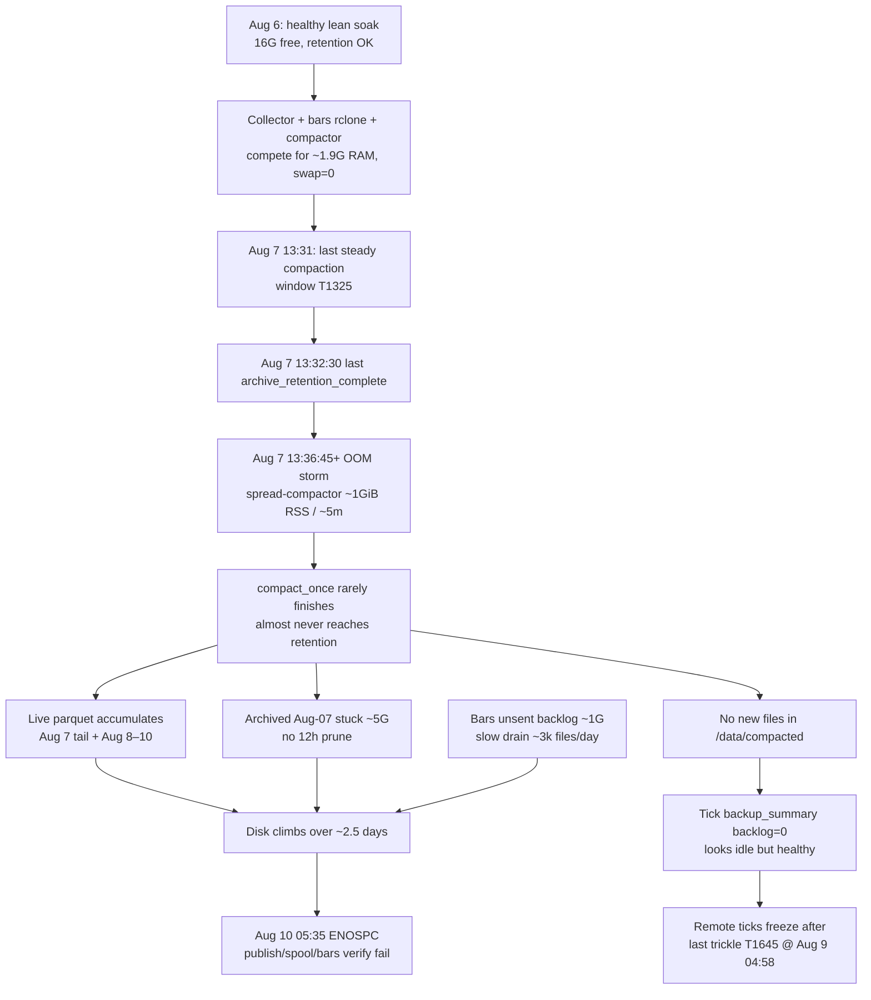

# Форенсика обрыва vacation — почему backup «встал» ~7 августа, а диск заполнился 10-го

> **Host migration (2026-08-10):** current production collector host is `root@38.180.94.108`. The IP below is the historical host for this report.

**Дата отчёта:** 2026-08-10 (UTC, повторный SSH ~13:24–13:35)  
**Контекст:** VPS `root@38.244.198.42`, runtime `spread-collector` → `app/screaner_b_o.py`  
**Связанные документы:** `docs/pre-leave-health-20260806.md`, `docs/vacation-return-20260810.md`, fix validation [`docs/compactor-fix-validation-20260810.md`](compactor-fix-validation-20260810.md), runbook [`docs/compaction-backup-runbook.md`](compaction-backup-runbook.md)  
**Режим:** только read-only forensics (деструктивный reclaim **не** выполнялся)

---

## Executive summary

Гипотеза «удаляется только sent, поэтому после остановки transfer ничего не чистилось» **частично верна по модели retention, но неверна как причина остановки tick-backup ~7 августа**. Tick `backup_transfer` **не ломался** (0 `transfer_failure`; `backlog_files_count=0` с ~13:00 UTC 7.08): он просто **не получал новых файлов из `/data/compacted`**. Первопричина — **OOM-шторм `spread-compactor`**, стартовавший **2026-08-07 13:36:45 UTC** (через ~4 минуты после последнего `archive_retention_complete`). Compactor стал убиваться каждые ~5 минут (~1 GiB RSS), почти не успевая компактить live и **ни разу не доходя до фазы archive retention** после 13:32. Live/archived на локальном диске росли 2.5+ суток; ENOSPC зафиксирован только **2026-08-10 05:35 UTC**. Bars (~1.2 GiB pending) — вторичный вклад; основной объём — **нескомпакченный `/data/live` (~12.4 GiB) + застрявший `/data/live/archived` Aug-07 (~4.6–5.3 GiB)**.

---

## 1. Pipeline block

| Поле | Значение |
|------|----------|
| Track | 1 — collection / storage reliability |
| Stage | compaction → archive retention → backup transfer (ticks + bars) |
| Environment | VPS runtime + local first materialization (`/data/*`); durable = `backup1tb:*` |
| Implementing ownership | Runtime Storage (read-only forensics) |
| Validation gate | этот отчёт + сверка с `vacation-return-20260810.md` |

---

## 2. Retention model (что удаляется и когда)

Код + systemd production flags:

| Слой | Модуль / unit | Когда удаляется | Что **не** удаляется |
|------|---------------|-----------------|----------------------|
| **Live → archived** | `compactor._archive_sources` | Только после успешного `compaction_complete` для окна (sources переносятся в `/data/live/archived/...`) | Активный `/data/live/**` до compaction |
| **Archive retention** | `compactor._apply_archive_retention` + `--retention-hours 12` в `spread-compactor.service` | Файл в `archived/`, путь ∈ `retention_eligible` (sources из **complete**/успешно обработанных манифестов), `mtime < now−12h` | Uncompacted live; archived, если run не дошёл до retention; файлы вне eligible-set |
| **Compacted → sent** | `backup_transfer._move_confirmed_source` | После rclone copy + size verify + **download_verify SHA** + `mark_confirmed` | Unsent backlog в `/data/compacted/*.parquet` |
| **Sent retention (ticks)** | `backup_transfer.remove_expired_sent_files` + `BACKUP_SENT_RETENTION_HOURS=12` | Только файлы в `sent/` со `state=sent` и `sent_at < now−12h` | Pending/failed; remote copies |
| **Bars** | тот же `backup_transfer` (`--layout hive`, `/data/bars`) + 12h sent retention | Аналогично: prune только после successful transfer → `sent/` | **Весь unsent hive backlog** (`bar_5m/...`) остаётся на диске |
| **Spool TTL** | `spool.py` | Monitoring-only (не авто-delete) | — |

Ключевые инварианты из кода:

1. **Archive retention требует успешного завершения `compact_once()`** — retention вызывается в конце (`archive_retention_complete`). OOM/`SIGKILL` до этой строки = **ноль prune** за этот tick таймера.
2. **Unsent compacted backlog не prune-ится** archive/sent retention’ом.
3. **Unsent live не prune-ится никогда** текущей конфигурацией.
4. Гипотеза пользователя верна для **sent/** и для **bars pending**; для основного роста диска важнее пункт 1+3.

---

## 3. Хронология (UTC) с цитатами

### Сводка по дням

| День | Compaction complete | Archive retention | Compactor OOM (memcg, syslog) | Tick backup | Диск |
|------|--------------------:|------------------:|------------------------------:|-------------|------|
| **Aug 6** | 269 | 265 (sum removed ≈435k files) | ~44 | healthy, backlog≈0–1 | pre-leave: **16G free** |
| **Aug 7** | 158 (last window `T1325` @13:31) | 153; **last @13:32:30** | ~270; storm с **13:36** | backlog→0 после ~12–13h; transfers ещё едят старый compacted | рост live начинается |
| **Aug 8** | 9 (окна всё ещё Aug-07) | **0** | ~574 (~каждые 5m) | редкие transfers Aug-07 окон | live Aug-08 ≈4.4 GiB |
| **Aug 9** | 3 (@04:45–04:46) | **0** | ~510 | **последний tick sent 04:58** `…T1645…` | live Aug-09 ≈4.6 GiB |
| **Aug 10** | 0 | 0 | продолжается | backlog=0 (нечего грузить) | **ENOSPC 05:35**; df 100% |

### Детальная лента

| Когда (UTC) | Событие | Доказательство |
|-------------|---------|----------------|
| Aug 6 ~12:08 | Baseline уезда: ticks OK, archive retention 12h работает, bars backlog ~60k, disk 16G free, OOM-риск | `docs/pre-leave-health-20260806.md` |
| Aug 6 09:20 / 15:30 | Collector OOM (редко) | syslog `task_memcg=...spread-collector` |
| Aug 6 весь день | Compaction+retention в норме; tick remote полный день | `compactor.log*`: 269 complete / 265 retention; backup log: 288 sent windows for `20260806` |
| Aug 7 00:11 / 10:56 | Ещё collector OOM | syslog collector memcg |
| Aug 7 до ~13:31 | Compaction ещё идёт почти в реальном времени | last complete: `spread_20260807T132500Z_…T133000Z` @ `2026-08-07T13:31:42Z` |
| **Aug 7 13:32:30** | **Последний `archive_retention_complete`** (`removed_files=1680`) | `compactor.log*` |
| **Aug 7 13:36:10+** | Следующий timer: только `compaction_artifact_offloaded` (перескан complete-манифестов) | `compactor.log` |
| **Aug 7 13:36:45** | **Первый OOM compactor после обрыва retention**; victim python ~1.0 GiB anon-rss, `task_memcg=...spread-compactor` | `/var/log/syslog.1` |
| Aug 7 13:36 → 23:59 | ~каждые 5 минут OOM compactor; **0** `archive_retention_complete`; **0** новых `compaction_complete` | syslog hourly ~12 kills/h (учёт double-log); compactor log |
| Aug 7 12:00–23:00 | Tick `backup_summary`: `backlog_files_count=0`, `transfer_attempt=0` | `/var/log/spread/backup-transfer.log` (epoch→UTC) |
| Aug 8 04:07–04:09 | Редкий «прорыв»: 6 complete для `T1440…T1510`, затем снова тишина; retention снова не достигнута | `compactor.log` |
| Aug 8 04:17–04:33 + 23:55–23:59 | Tick backup успешно увозит эти окна (и соседние) | `transfer_result` success |
| Aug 9 04:45–04:46 | Последние logged `compaction_complete`: `T1625…T1635` | `compactor.log` |
| **Aug 9 04:58:06** | **Последний successful tick transfer**: `spread_20260807T164500Z_…T165000Z.parquet` | backup log + sqlite `sent_at` max |
| Aug 9 04:58 → Aug 10 | `/data/compacted` pending = 0; remote ticks не растут для Aug 8–10 | vacation-return + текущий `ls /data/compacted/*.parquet` → 0 |
| Aug 7–10 | Bars transfer **продолжается** (~3.1k файлов/день), но ≪ ingest; backlog к утру Aug 10 ≈ **279 808 / 954 MB** | bars log `backup_summary` @ 03:31 Aug 10 |
| **Aug 10 05:35:02** | Первые `No space left on device` (bars + live); spool/quarantine fail | `runtime.log` |
| Aug 10 05:35 | Bars `download_verify` падает: `preallocate: file too big for remaining disk space` | bars-backup log + vacation-return |
| Aug 10 ~12:48 | `df`: 30G / **0 avail / 100%** | SSH |
| Aug 10 12:54 | Safe journal vacuum (~615M) — кратко оживил publish, диск всё ещё ~100% | vacation-return |

### Снимок диска на момент форенсики (~13:30 UTC Aug 10)

| Путь | Размер / count | Роль в заполнении |
|------|----------------|-------------------|
| `/data/live` (без archive) | **~12.4 GiB**, 807k+ parquet | **Главный рост** — нескомпакченное |
| ↳ event_date=2026-08-07 | 1.64 GiB / 108k | хвост после обрыва compaction |
| ↳ 2026-08-08 | 4.36 GiB / 286k | полный день только local |
| ↳ 2026-08-09 | 4.61 GiB / 302k | полный день только local |
| ↳ 2026-08-10 | 1.76 GiB / ~115k | до ENOSPC |
| `/data/live/archived` | **~5.3 GiB**, только `event_date=2026-08-07` (296k files, ~4.57 GiB data) | retention не бежала с 13:32 Aug 7 |
| `/data/compacted` | 168 M (почти всё `.state`, **902** json manifests); pending parquet **0**; `sent/` ≈16 K | sent retention сработала; backlog пуст |
| `/data/bars` | ~1.2 GiB | вторичный; unsent не prune |
| `/var/log/spread` | ~0.5 GiB | вторичный |

Tick sqlite: `sent=903 / ~11.0 GiB` учтено как transferred; newest `sent_at=2026-08-09 04:58:06Z`.  
Bars sqlite: `sent=14901`; pending row≈1 (остальной backlog ещё не в manifest до attempt).

---

## 4. Causal chain

### Корневая причина vs симптомы

| Вопрос | Ответ по evidence |
|--------|-------------------|
| Почему «backup остановился» ~Aug 7? | **Не rclone/lock/ENOSPC.** Compactor OOM → нет новых compacted → tick transfer idle (`backlog=0`). Последний durable tick уехал только **Aug 9 04:58** (хвост окон Aug 7). |
| Почему диск заполнился, хотя retention настроен? | Retention **не покрывает uncompacted live**. Archive retention **перестала исполняться** с Aug 7 13:32 (OOM до конца run). Sent retention ticks **работала** (`sent/` пуст). Bars pending **не prune** до sent — но это ~1 GiB, не 20 GiB. |
| Роль bars? | Throughput debt известен с pre-leave; ~3k/day ok vs сотни k pending; **не** primary disk filler. |
| Роль collector OOM? | 9 restarts за отпуск — короткие ingest gaps; **не** останавливал compaction pipeline. Жертва шторма — **compactor**. |

---

## 5. Прямые ответы на вопросы пользователя

### (1) Почему backup остановился около 7 августа, если диск заполнился только 10-го?

Потому что **остановился не transfer, а upstream compaction**.

- 7 августа **13:36 UTC** начался устойчивый OOM-kill `spread-compactor` (~каждый timer 5m, RSS ~1 GiB).
- С этого момента почти не появляются новые файлы в `/data/compacted`.
- `spread-backup-transfer` продолжает успешно стартовать и писать `backup_summary` с **`backlog_files_count=0`** — это выглядит как «backup встал», но это **голодный успех**.
- Редкие прорывы compaction Aug 8–9 ещё успели докинуть remote до окна **`…T1645…`** (последний sent 9.08 04:58). Aug 8–10 на remote нет, потому что эти сутки **так и не были скомпакчены**.

Диск при этом ещё имел запас: pre-leave 16G free; рост ~5–7 GiB/сутки live без prune → cliff на утро 10.08.

### (2) Как диск заполнился при настроенном deletion/retention?

**Модель retention не удаляет то, что выросло.**

1. **Live** удаляется только после compaction→archive→(12h mtime) retention. Без compaction live растёт безлимитно → **~12.4 GiB**.
2. **Archive retention** с 7.08 13:32 **не вызывалась** (OOM до конца `compact_once`) → застряло **~5 GiB** Aug-07 archived.
3. **Sent retention** удаляет только уже успешно увезённое; для ticks это как раз сработало (`sent/` ≈ пуст). Это **не спасает** live.
4. **Bars**: pending не prune до sent; ~1.2 GiB — усилитель, не корень.

Итого: гипотеза «только sent чистится» верна как **описание sent-path**, но диск убил связка **OOM → нет compaction → нет archive retention → unbounded live**.

---

## 6. Что могло бы предотвратить

1. **Память для compactor:** swap / меньше параллелизма (не гонять bars rclone verify одновременно с heavy compact) / MemoryMax+очередь; pre-leave уже foreshadowed OOM.
2. **Compaction backpressure alert:** если `archive_retention_complete` отсутствует N циклов или live age/bytes растет при `backup backlog=0` → page.
3. **Retention, не завязанный на полный успешный compact run** (отдельный oneshot prune для eligible archived) — сейчас single point of failure.
4. **Ограничение роста live** (disk watermark → drop/sample/pause bars) — сейчас нет hard cap.
5. **Bars:** verify-on-full-disk не должен убивать drain; отдельный throughput plan (уже в vacation-return).
6. **Не путать `backlog=0` с health** — нужен сигнал «compaction lag vs wall clock».

---

## 7. Рекомендуемая последовательность reclaim (только после явного OK)

> **Не выполнять без нового явного разрешения.** Ниже — порядок с минимальным риском потери ещё не durable данных.

1. **Safe non-data:** `journalctl --vacuum-size=…`, ротация/сжатие огромных логов (`syslog.1` ~885M был), tmp verify dirs.
2. **Сверить remote ticks** (`backup1tb:spread-compacted`) с sqlite `sent` — уже 903 sent / remote ~902 objects historically.
3. **Кандидат на удаление после сверки:** `/data/live/archived/**` для окон, чьи compacted outputs **есть на remote** и в sqlite `state=sent` (Aug-07 archived ~5G — главный быстрый выигрыш **если** remote покрывает соответствующие окна).  
   - Не трогать uncompacted `/data/live/event_date=2026-08-0[789]*` пока нет compaction→remote.
4. **Временно остановить/развести** `spread-compactor` и bars-backup при emergency reclaim, чтобы OOM не мешал; collector — только если нужно срочно остановить рост (это уже потеря ingest).
5. После появления free space: **дожать compaction** Aug 7 16:50 → Aug 10 из live → backup → только потом prune.
6. Bars backlog — отдельный drain после стабилизации диска; не массово delete unsent bars.

---

## 8. Success criteria этого отчёта

- [x] Подтверждена code-level модель retention (archive vs sent vs bars).
- [x] Найдена минута обрыва archive retention и минута старта OOM storm.
- [x] Показано, что tick backup не failing, а starved.
- [x] Оцифрован вклад live / archived / bars в ENOSPC.
- [x] Явные ответы на 2 вопроса пользователя.
- [x] Destructive reclaim archived (verified durable) — выполнен 2026-08-10 в рамках [`compactor-fix-validation-20260810.md`](compactor-fix-validation-20260810.md) (~2.98 GiB).
- [x] Hardening streaming compactor + alerts — см. тот же validation doc.

---

## 9. Recommended next step

Продолжить salvage compact (`--max-windows 1`) + tick/bars backup drain до закрытия live Aug 8–10; держать `MemoryMax=1200M` и `Conflicts=` с bars. Collector/timers только при free disk ≳7–8 GiB и стабильном RSS.
